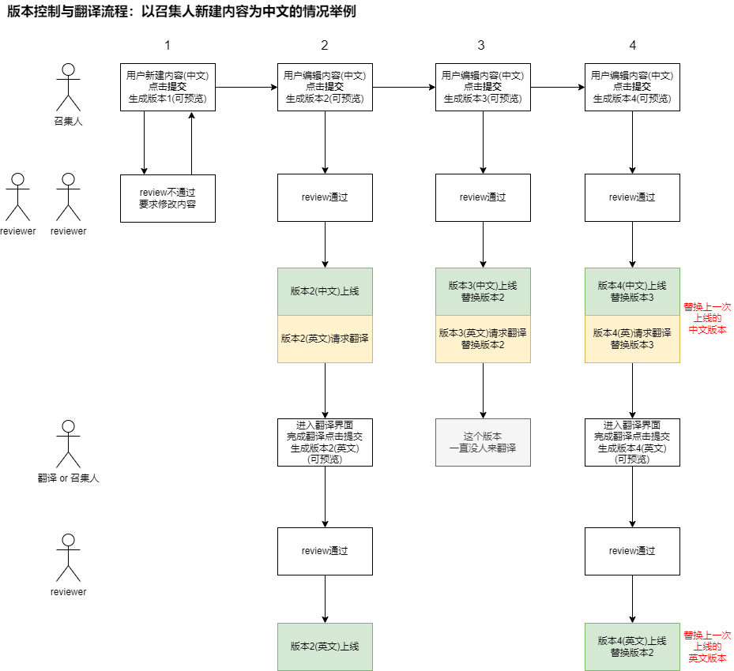

# 关于内容审核、版本控制与国际化

## 功能说明

1. 原则上2050网站上线的所有内容要合法合规，包括文字、图片、视频
1. 内容的合法合规性最好能用机器自动审核来完成，不要用人工
1. 内容的质量好坏由人工完成审核，原则上2个reviewer通过就可以上线
1. 网站支持中文和英文双语，原则上使用人工翻译，不用机翻
1. 版本控制功能在这里有三个作用：
    1. 一个内容通过审核后又进行了修改，这时可以在新的内容等待审核的时候不影响之前已经上线的内容
    1. 一个内容的翻译通过审核后又进行了修改，这时可以在新的翻译没做好之前不影响之前已经上线的翻译
    1. 把2050发生的过程给记录保留下来

## 含版本控制逻辑的文字内容审核与翻译流程

需要使用上述流程的内容有：

1. 用户
    1. 用户姓名（合法即可）
    1. 公开显示的联系方式（合法即可）
    1. 一句话介绍（合法+质量）
1. 蜂巢
    1. 蜂巢名称（合法+质量）
    1. 蜂巢介绍（合法+质量）
1. 活动（十大容器）
    1. 活动名称（合法+质量）
    1. 活动介绍（合法+质量）

## 图片的审核

需要审核的图片有：

1. 用户头像（合法即可）
1. 蜂巢logo（合法+质量）
1. 活动的横版海报（合法+质量）
1. 活动的竖版海报（合法+质量）
1. 活动照片（合法即可）

## 视频的审核

需要审核的视频有：

1. 活动视频（合法即可）