# PASS激活（下单订购）流程

其中，激活PASS的操作分两种情况：

1. 用户付费激活自己的PASS
1. 用户付费激活别人的PASS

第二种情况常见于自愿者带来子女/父母/亲戚朋友、或者公司组织员工、学校组织师生一起来参加2050的场景。因此，批量激活多张PASS也是常见的需求。

## 为自己激活PASS

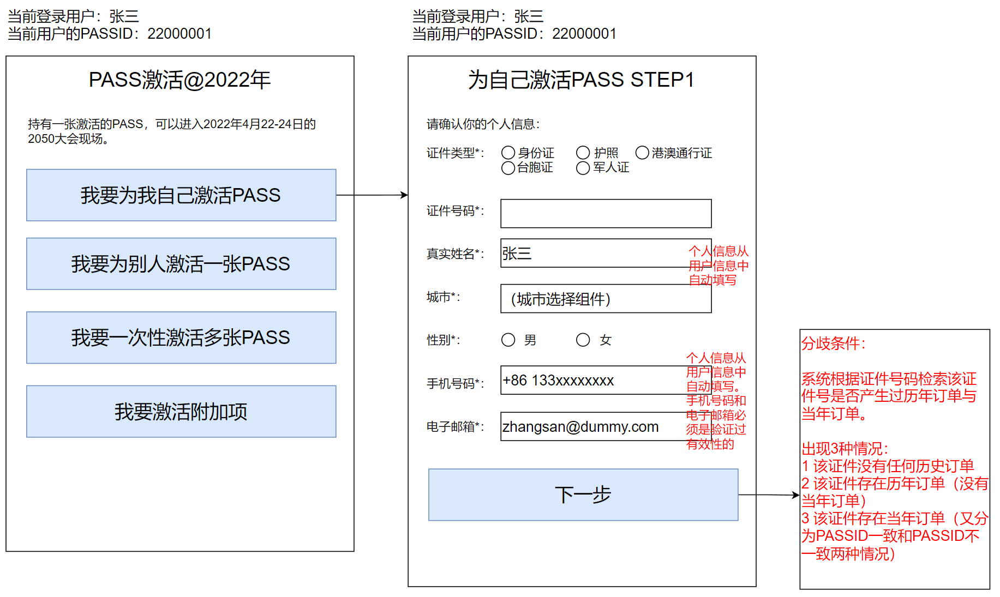

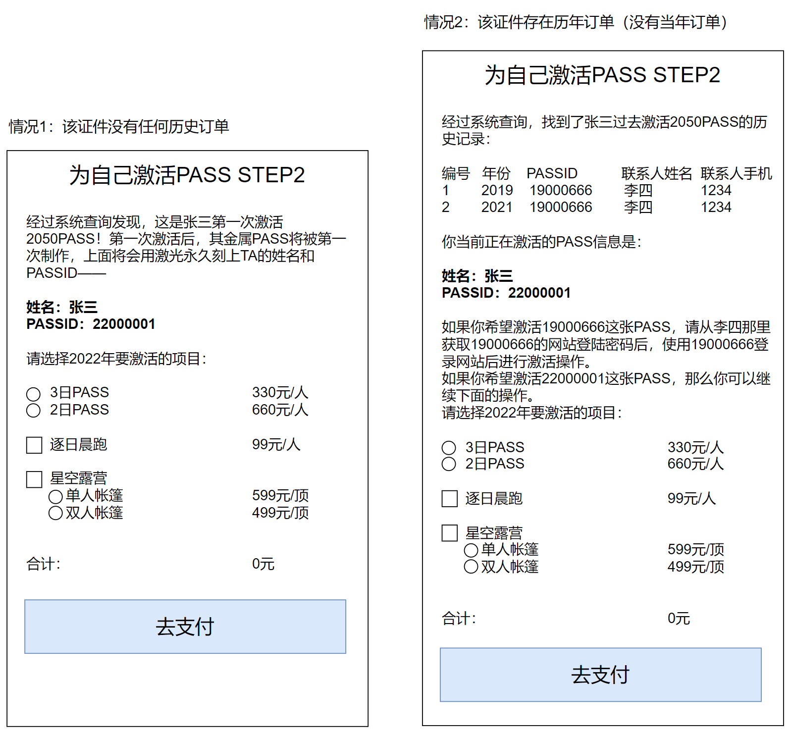

**注意**：

对于情况2当中“存在历年订单与历年PASSID且PASSID与当前登录用户的PASSID不一致”的情况，当用户选择**继续激活新的PASS**时，在支付完成时，**需要在2050网站用户系统当中将该身份证信息保存到新的PASSID上面**。至于老PASSID上面绑定的身份证信息是否需要清除，可以在具体代码实现时再根据情况评估。

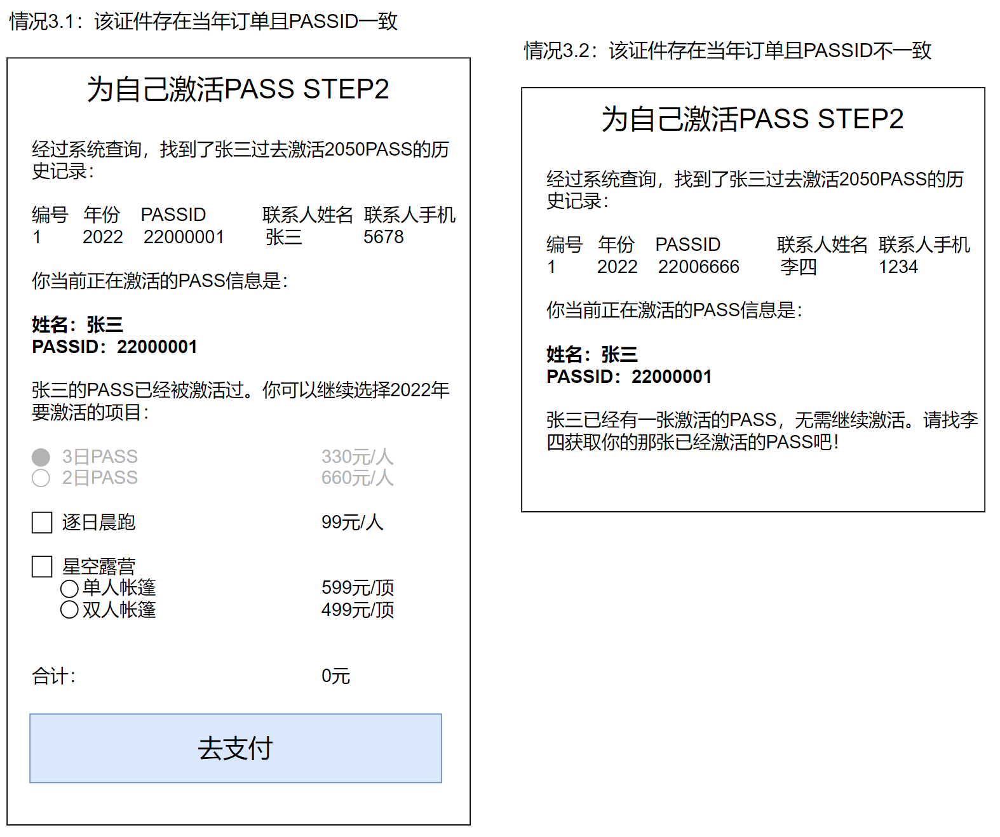

支付完成后的返回信息：

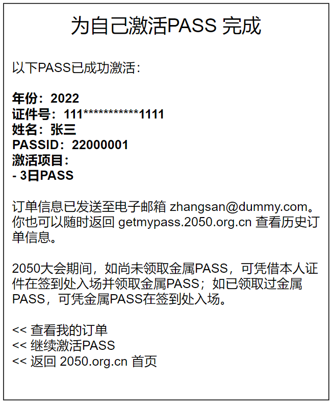

## 为别人激活一张PASS

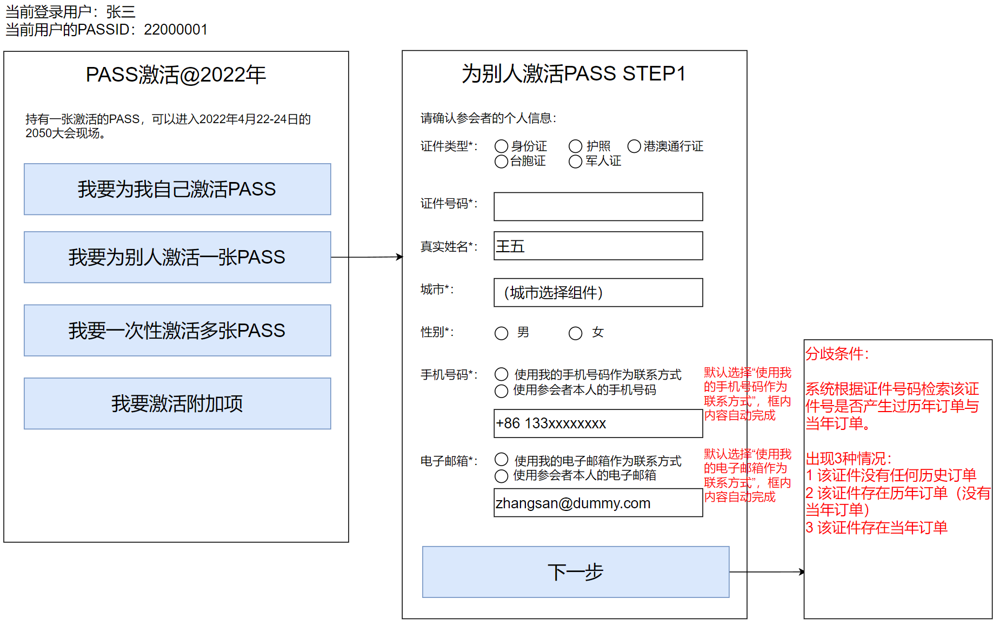

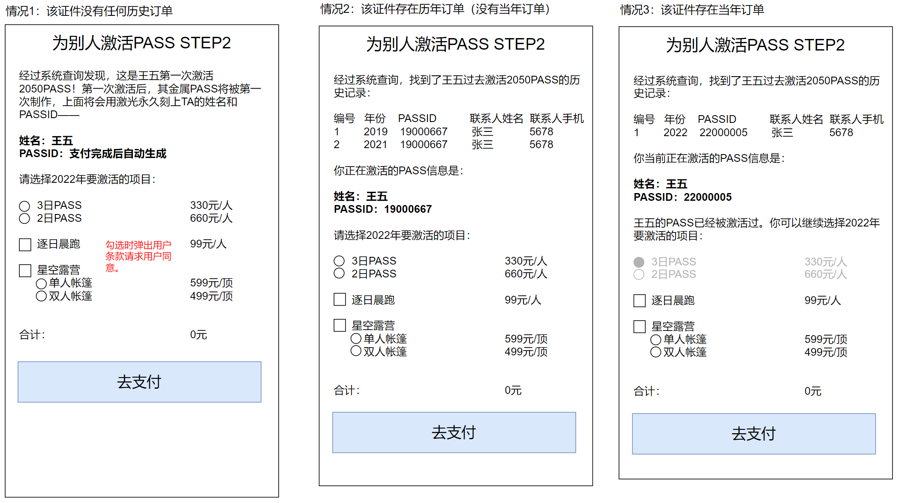

此处对于情况2还有一种例外情况，就是该证件号检索到2018年的历史订单，这种情况也是没有历史PASSID，因此需要生成新的PASSID的：

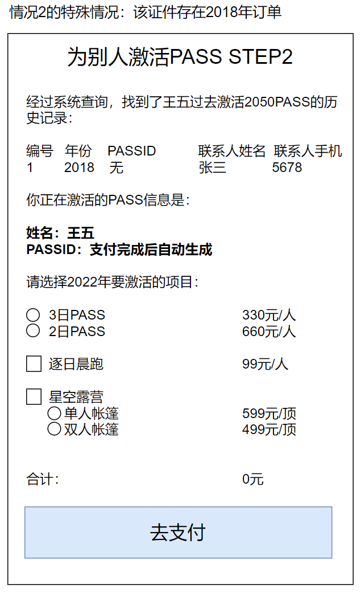

注意：仅在“为别人激活PASS”且“该身份证没有历史订单”的情况下，才会触发“支付完成后自动生成一个新的PASSID+初始登录密码”的动作，从而需要将该“新的PASSID+初始登陆密码”信息告知代购人。

这里需要注意的另一点是，即使代购人填写了被代购人的电话号码和电子邮箱，我们也仍然需要将“新的PASSID+初始登陆密码”信息同步发送给代购人，因为**只有代购人的手机号码是经过验证确保有效的**，被代购人的手机号码则无法保证其有效性。

支付完成后的返回信息：

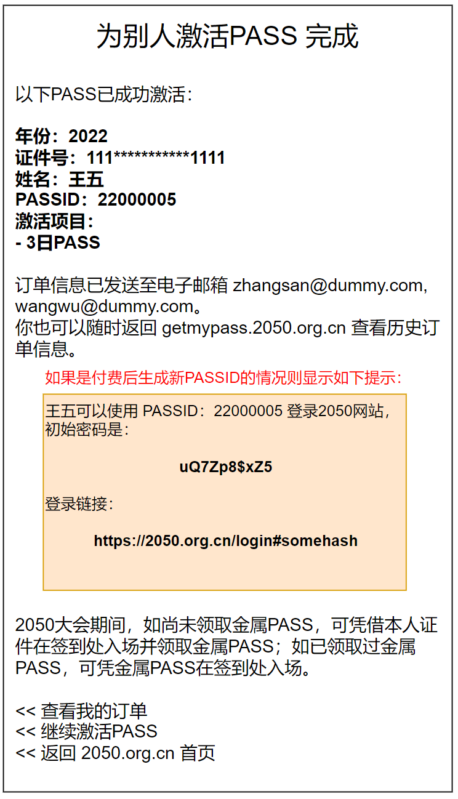

## 批量激活多张PASS

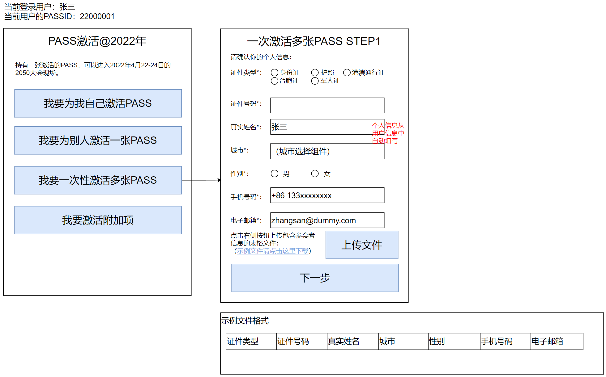

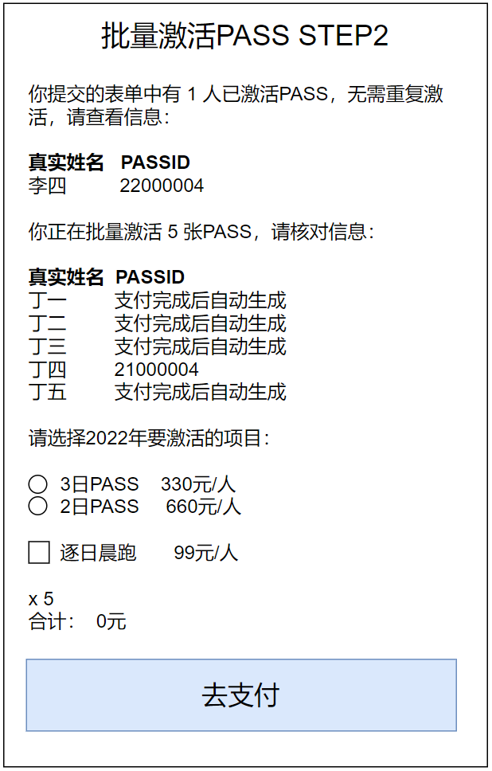

支付完成后的返回信息：

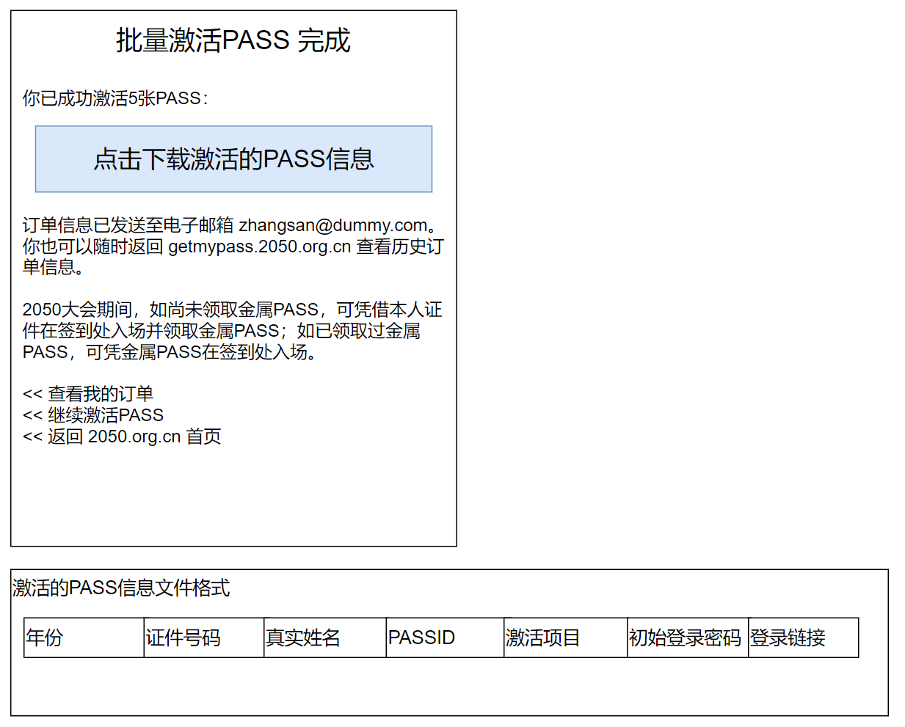

## 激活附加项

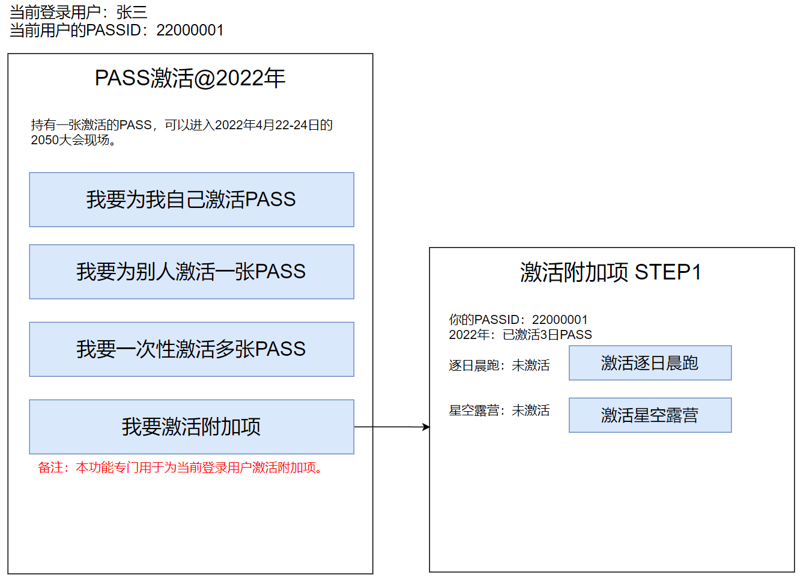

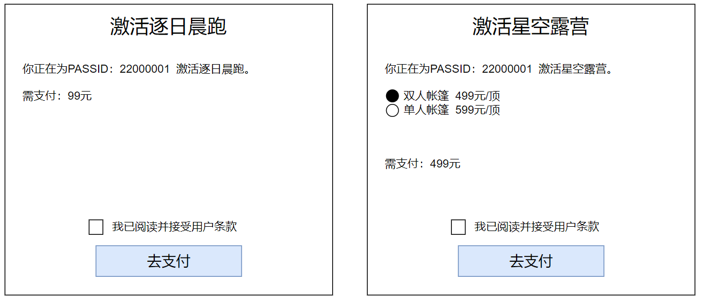

支付完成后的返回信息：

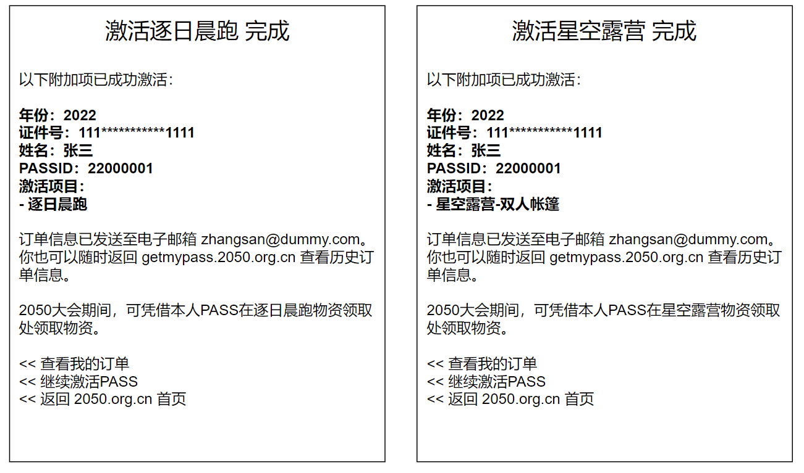