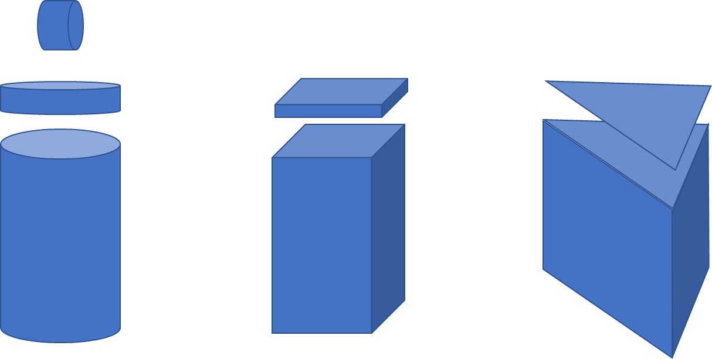
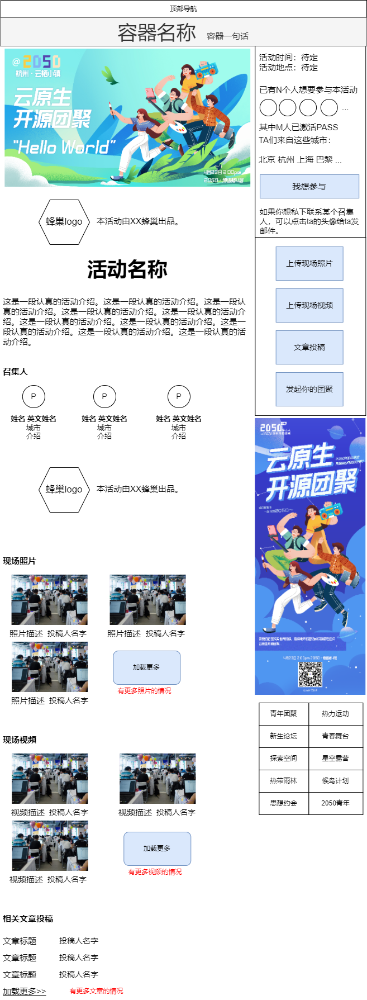

# 十大容器概述（含流程）

## 什么是容器

- 不同的容器，可以容纳不同类型的活动，有些“不完全符合的类型”，也可以加入某个容器
- 活动类型的差别，主要在于：人员、场地、时间，以及其他差异（备注表示）
- 比如：有些活动有人员上限（<100人）；有些活动有选择参与（思想约会，30人抽取3~5人）；有些没有人员邀请（百城味道，不用报名，随到随吃）
- 比如：有些活动有场地要求（一间教室，一个会议室，一个操场，3㎡展区），有些没有场地要求（思想约会，知道在哪里找到人就行）
- 比如 ：有些活动有时间要求（早上10~12点），有些时间是开区间（周六晚上8点以后，通宵Party）

## 十大容器中英文名称

- 青年团聚@2050：年青就要最认真见面 Youth Reunion@2050: Youth is heartfelt connection
- 新生论坛@2050：年青就要最大声分享 New Generation Forum@2050: Youth is outspoken
- 探索空间@2050：年青就要最靠近挑战 Explorer Space@2050: Youth is closest to the challenge
- 热带雨林@2050：每个年青人都是新物种 Everything Grows@2050: Youth is a new living being
- 思想约会@2050：分享时间是真诚 Mindnet@2050: Sincerity is the sharing of time
- 热力运动@2050：年青活力的散发 Game On@2050: Vitality & dynamic movement
- 逐日晨跑  Chasing the Rising Sun Run
- 足球风暴  Soccer Storm
- 星空露营@2050：享受仰望星空 Starry Night Camping@2050: Enjoy looking up at the stars
- 青春舞台@2050：科技就像音乐 Youth Stage@2050: Tech is just like a melody
- 候鸟计划@2050：努力让年青人见上另一位年青人 Migratory Bird Program: Taking great strides for the youth to meet each other
- 2050青年： 致敬为2050付出努力的年青人 2050 Youth: A salute to the youth who are committed to 2050

另有不属于十大容器但是需要网站当作容器进行功能实现的活动类型：

- 百城味道 Tastes of the cities

## 每个容器各自所容纳的活动特点

见后续每个容器各自详情页。

## 单独活动页基础模板

无论是哪一个容器下的活动，其基本页面构成大体上都是下面这个结构，不会偏离太多：

## 通用数据字段

- 活动ID
- 活动名称（中文、英文）
- 活动介绍（中文、英文）
- 出品本活动的蜂巢（1个）
- 召集人用户ID（1~10个）
- 海报横版
- 海报竖版
- 上线时间（提交时间/最后修改时间/审核通过的上线时间）
- reviewer用户ID（2个）
- 活动时间（1个时间段）
- 活动地点
---
- 想要参与本活动的用户ID（0~20000个）
- 上传到本活动的照片（0~不限）
- 上传到本活动的视频（0~不限）
- 上传到本活动的投稿（0~不限）