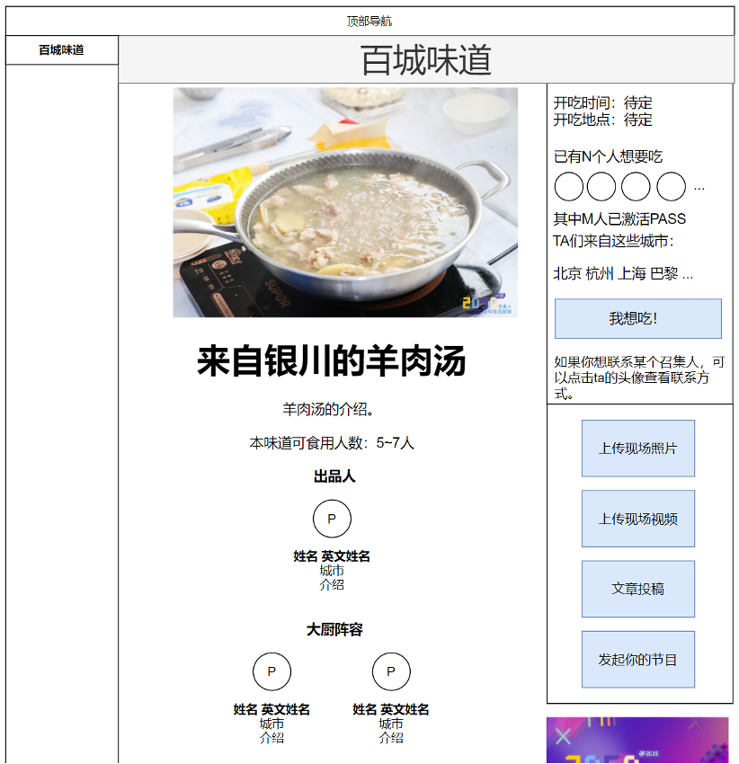

# 百城味道

## 百城味道-数据字段
* 味道ID
* 味道名称（中文、英文）
* 味道介绍（中文、英文）
* 味道来自哪个城市
* 味道够多少人吃
* 带来本味道的用户ID（1个）
* 是否需要现场烹饪（是/否）
* 大厨阵容用户ID（0~2个）
* 味道照片
* 上线时间（提交时间/最后修改时间/审核通过的上线时间）
* reviewer用户ID（2个）
* 开吃时间（1个时间点）
* 开吃地点（默认在固定用餐点。固定用餐点可能不止一个。）
* 想吃TA的用户ID（0~2000个）
* 上传到本味道的照片（0~不限）
* 上传到本味道的视频（0~不限）
* 上传到本味道的投稿（0~不限）