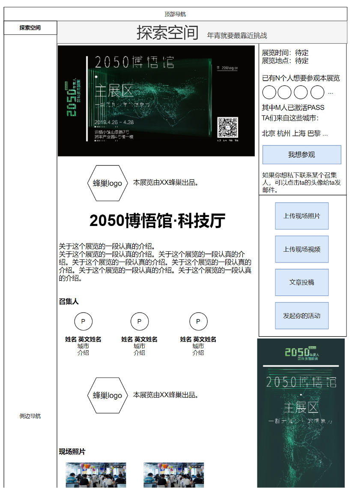

# 探索空间

## 探索空间-数据字段
* 展览ID
* 展览名称（中文、英文）
* 展览介绍（中文、英文）
* 出品本展览的蜂巢（1个）
* 召集人用户ID（1~10个）
* 海报横版
* 海报竖版
* 上线时间（提交时间/最后修改时间/审核通过的上线时间）
* reviewer用户ID（2个）
* 展览开放时间（可有多个时间段，如第二天与第三天的9-18）
* 展览地点
* 想要参与本活动的用户ID（0~20000个）
* 上传到本活动的照片（0~不限）
* 上传到本活动的视频（0~不限）
* 上传到本活动的投稿（0~不限）