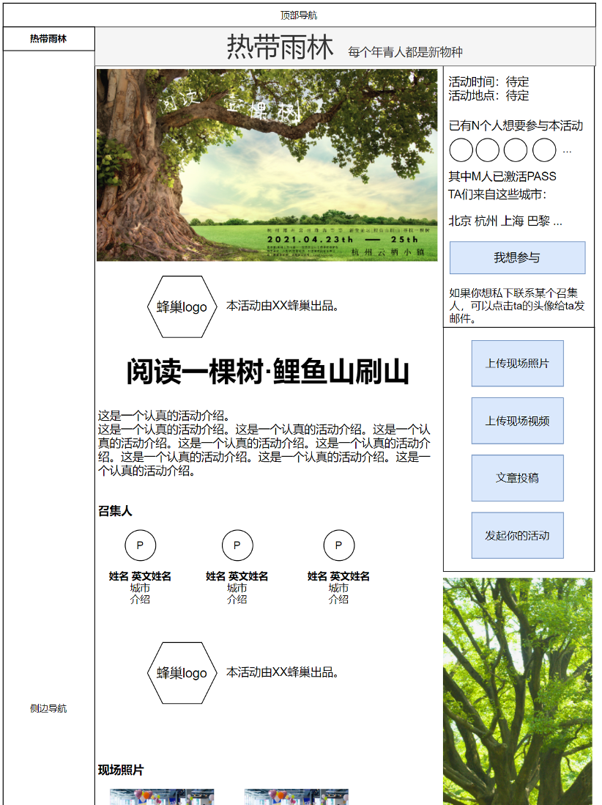

# 热带雨林

## 热带雨林-数据字段
* 活动ID
* 活动名称（中文、英文）
* 活动介绍（中文、英文）
* 出品本活动的蜂巢（1个）
* 召集人用户ID（1~10个）
* 海报横版
* 海报竖版
* 上线时间（提交时间/最后修改时间/审核通过的上线时间）
* reviewer用户ID（2个）
* 活动时间（可有多个时间段，如第二天与第三天的9-10）
* 活动地点
* 想要参与本活动的用户ID（0~20000个）
* 上传到本活动的照片（0~不限）
* 上传到本活动的视频（0~不限）
* 上传到本活动的投稿（0~不限）