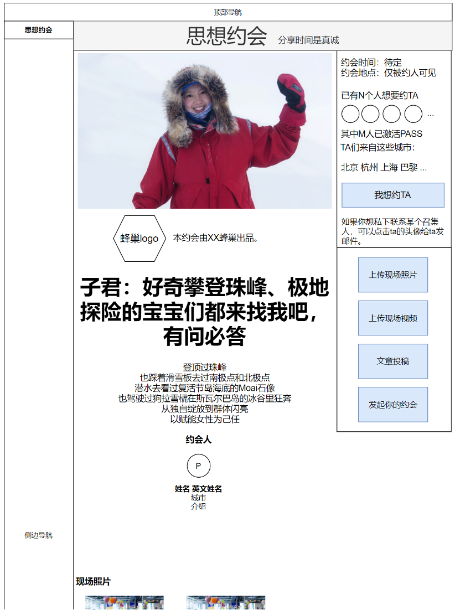
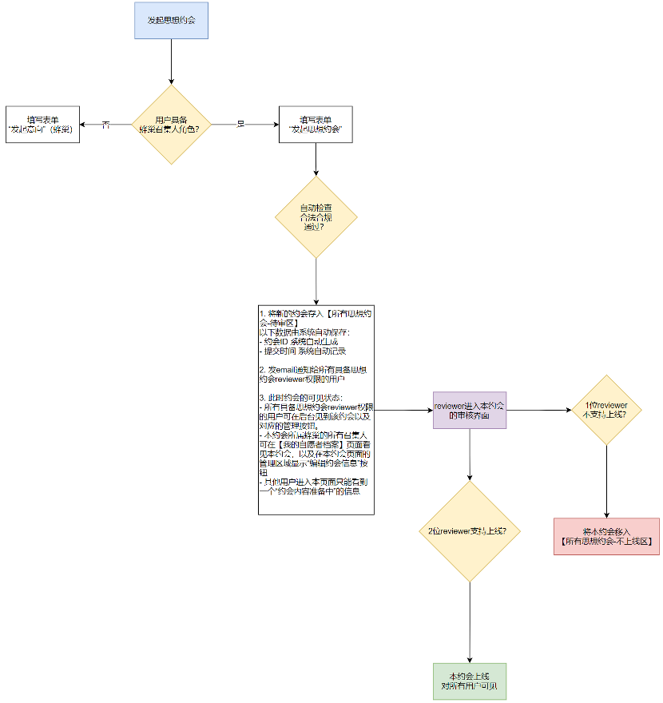
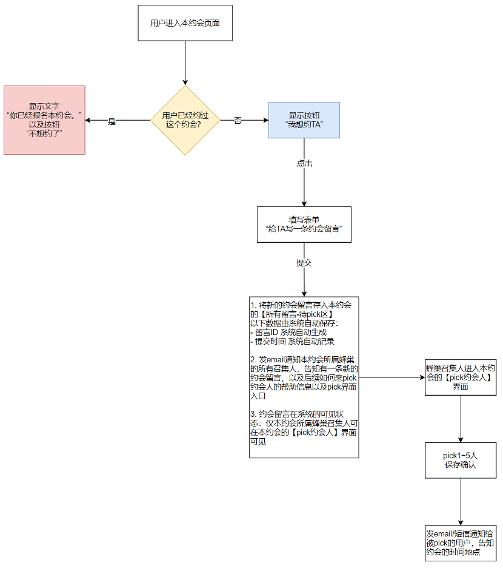
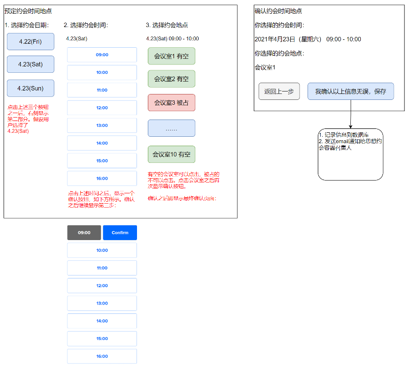
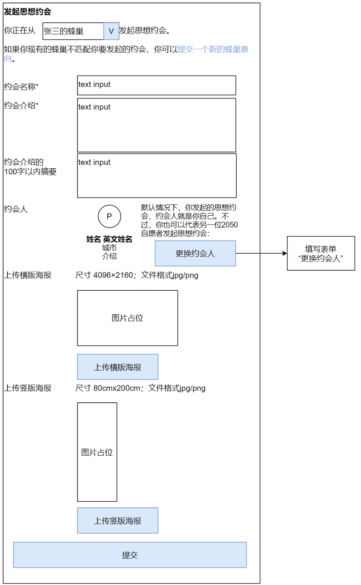
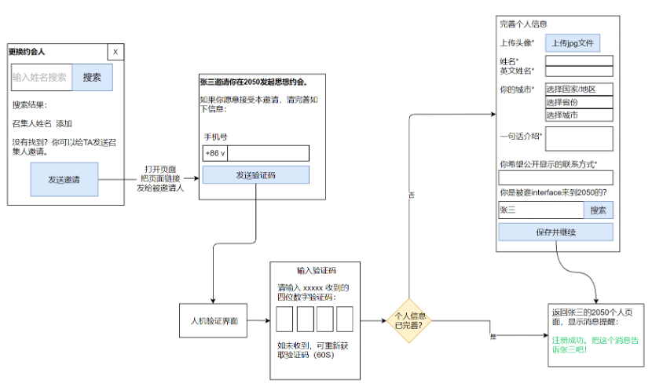
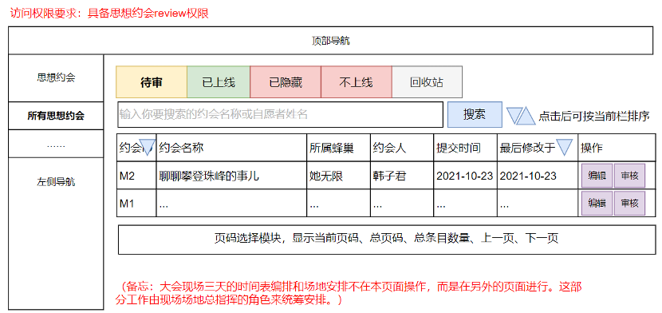
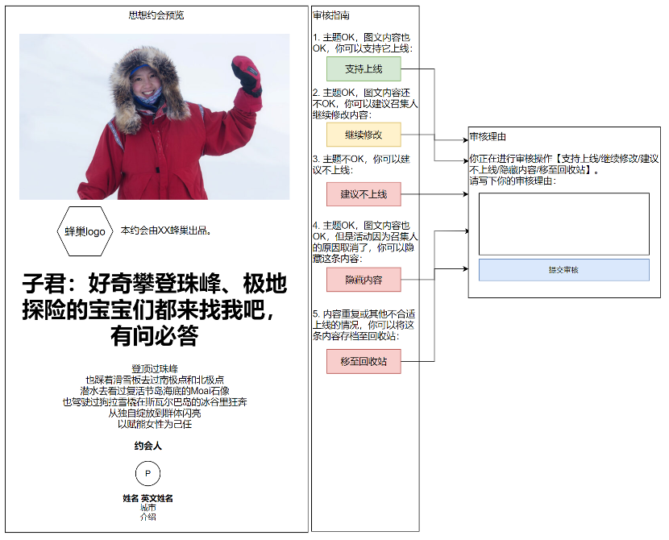
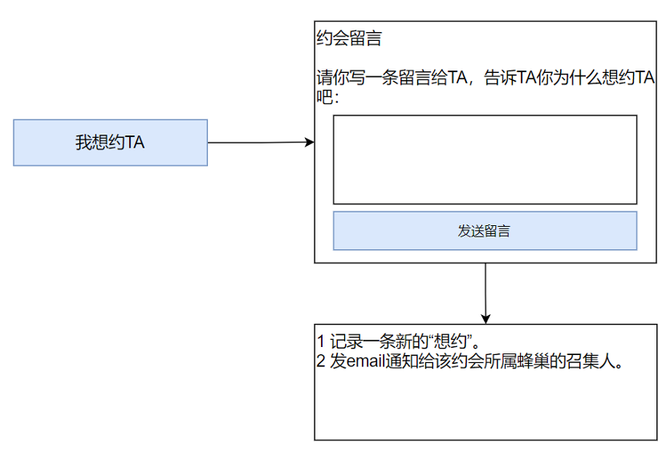
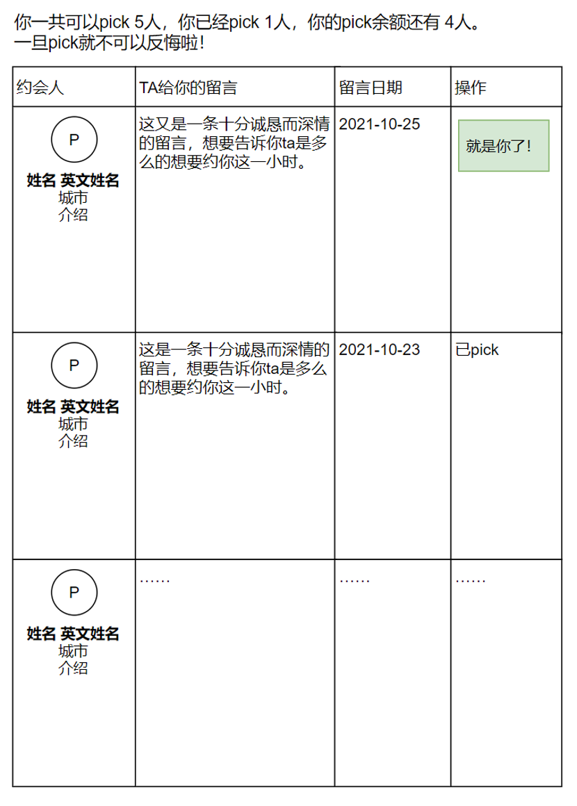

# 思想约会

## 发起思想约会流程图
* 前置判断：要求用户已经具备蜂巢召集人的角色（见蜂巢部分流程）。
* 如果不是召集人，那么先弹框提示，再跳转发起意向的表单。

24hr之内如果有人（小于2人）赞同无人反对就可以上线？
## pick约会人流程图
备注：
1. 一个约会的“想约”功能一直开放到本约会开始之前的24小时。
2. “pick”功能在约会场地确认后即可开放。这个时间点大约在大会开始前一周到三天左右。

## 给思想约会定时间
定时间的人是约会出品人（填写这个思想约会表单的人）1个小时
## 给思想约会定地点
* 定地点的前置条件：场地组已经把所有约会可用的场地盘清楚，保存在网站上了
* 定地点的人：历史上是思想约会容器召集人分配场地，想要实现自助约场地
* 会议室1~10当中选择
* 时间地点定了之后才能开放pick功能
## 表单 确认思想约会时间地点
备注：交互设计可参考 https://calendly.com/ 这个网站

## 数据字段
* 约会ID
* 约会名称（中文、英文）
* 约会介绍（中文、英文）
* 约会介绍的100字以内摘要（中文、英文）
* 出品本约会的蜂巢（1个）
* 约会人用户ID（1个）
* 海报横版
* 海报竖版
* 上线时间（提交时间/最后修改时间/审核通过的上线时间）
* reviewer用户ID（2个）
* 活动时间（1个时间段）
* 活动地点
* 想要参与本约会的用户ID（0~30个）
* 约会留言ID
* 约会留言内容
* 约会留言时间
* 通过召集人pick的用户ID（1~5个）
* 上传到本活动的照片（0~不限）
* 上传到本活动的视频（0~不限）
* 上传到本活动的投稿（0~不限）
## 表单“发起思想约会”

## 表单“编辑思想约会”
表单格局同“发起思想约会”。表单内文字有变更
## 所有思想约会（后台管理界面）

## 表单“审核思想约会”

## 表单“我想约TA”

## 表单“pick约会人”
pick约会人权限给到
1. 约会人本人
2. 这个约会的发起人
权限不给到对应蜂巢的其他召集人，也不给到思想约会的容器召集人
