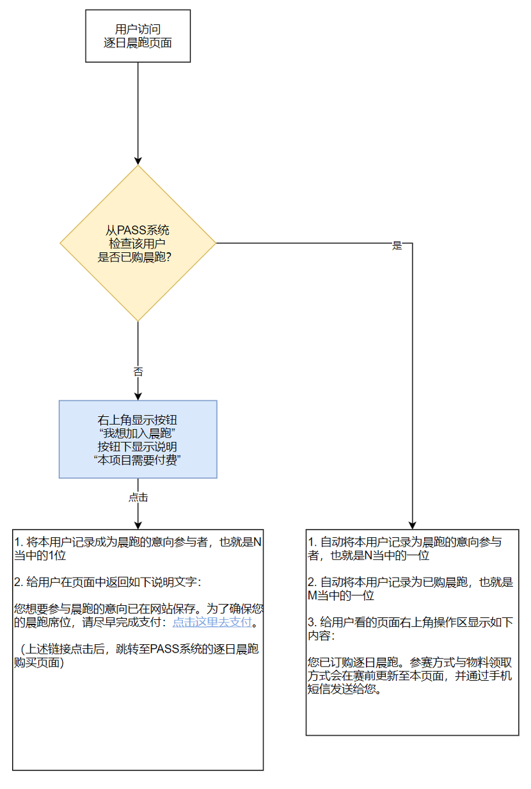

# 热力运动：逐日晨跑（每年固定活动）

## 逐日晨跑流程图

* 备注：以上流程以“用户访问”作为记录动作的触发动作，这就可能会导致一种情况，就是在PASS系统购买了逐日晨跑、但是没有访问过本页面的用户，则没有被记录到参与用户当中。
* 因此，我们需要额外添加一个定时任务，将PASS系统当中购买过晨跑的用户ID给拉过来。
## 逐日晨跑-数据字段
逐日晨跑属于“热带雨林”这个容器，但与其他活动有一点不同，其他活动不一定每一年都有，但逐日晨跑是每一年的2050一定有的活动。目前尚未出现活动形式与逐日晨跑完全一致的其他活动，也就是说，这种活动类型在每一年的2050大会上只有1个。因此，逐日晨跑不需要创建功能，而其编辑功能也不需要向前台的用户开放，只需在后台开放给逐日晨跑的召集人即可，并且其上线不需要另外的review。
* 赛事ID
* 赛事名称（中文、英文）
* 赛事介绍（中文、英文）
* 出品本赛事的蜂巢（1个）
* 召集人用户ID（1~10个）
* 海报横版
* 海报竖版
* 上线时间（提交时间/最后修改时间/审核通过的上线时间）
* 活动时间（1个时间段）
* 活动地点
* 想要加入晨跑的用户ID（0~20000个）
* 上传到本活动的照片（0~不限）
* 上传到本活动的视频（0~不限）
* 上传到本活动的投稿（0~不限）
* 【逐日晨跑-订单-数据字段】
* T-shirt尺寸（备注：T-shirt尺寸可以作为个人数据保存）
* 常规订单数据字段
## 表单-编辑逐日晨跑
备注：此表单初始状态下仅 超级管理员 和 热力运动容器召集人 可以访问。
