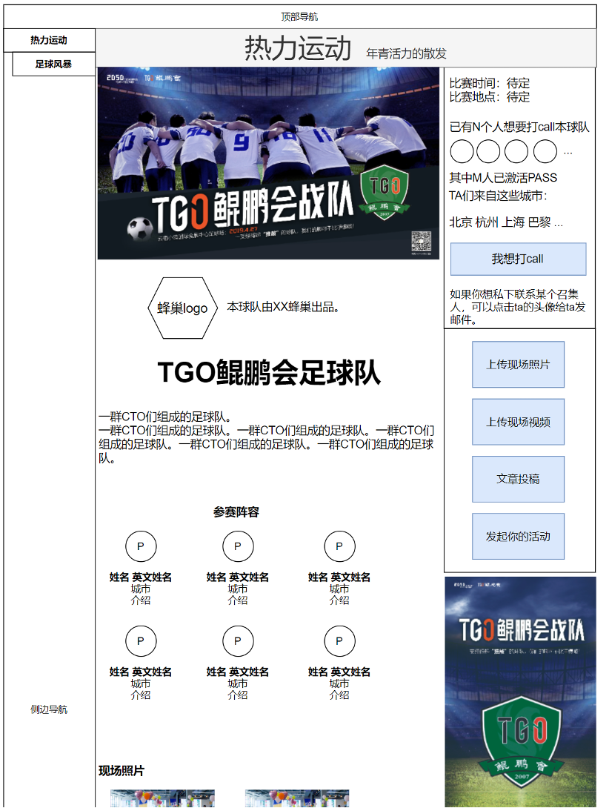

# 热力运动：足球风暴（活动）

## 足球风暴-数据字段
* 球队ID
* 球队名称（中文、英文）
* 球队介绍（中文、英文）
* 出品本球队的蜂巢（1个）
* 召集人用户ID（1~10个）
* 海报横版
* 海报竖版
* 上线时间（提交时间/最后修改时间/审核通过的上线时间）
* reviewer用户ID（2个）
* 首场比赛时间（1个时间段）
* 首场比赛地点（默认在足球场）
* 想要加入球队的用户ID（0~30个）
* 通过review的参赛选手用户ID（1~10个）
* 上传到本活动的照片（0~不限）
* 上传到本活动的视频（0~不限）
* 上传到本活动的投稿（0~不限）