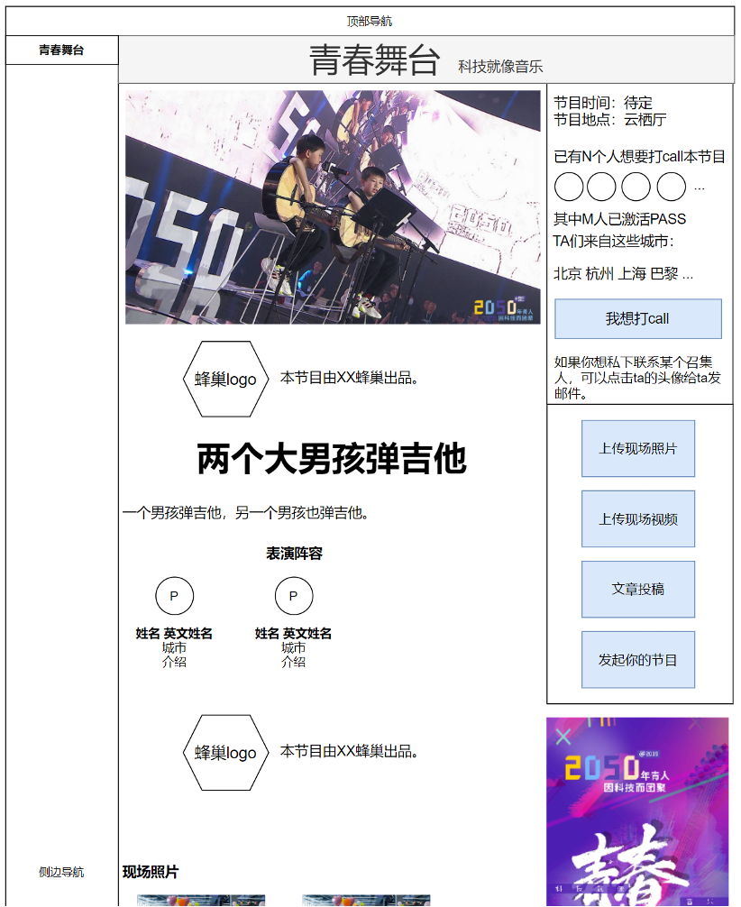

# 青春舞台

## 青春舞台-数据字段
* 节目ID
* 节目名称（中文、英文）
* 节目介绍（中文、英文）
* 出品本节目的蜂巢（1个）
* 表演者用户ID（1~10个）
* 海报横版
* 海报竖版
* 上线时间（提交时间/最后修改时间/审核通过的上线时间）
* reviewer用户ID（2个）
* 节目时间（1个时间段）
* 节目地点（默认在云栖厅）
* 想要打call本节目的用户ID（0~2000个）
* 上传到本活动的照片（0~不限）
* 上传到本活动的视频（0~不限）
* 上传到本活动的投稿（0~不限）