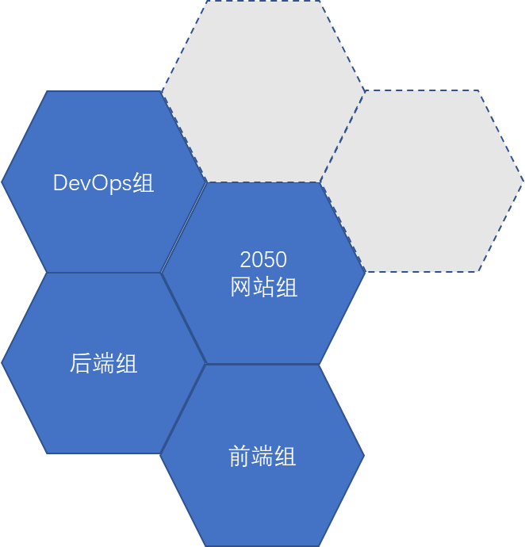
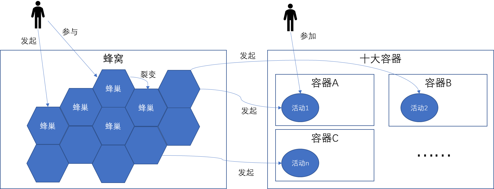
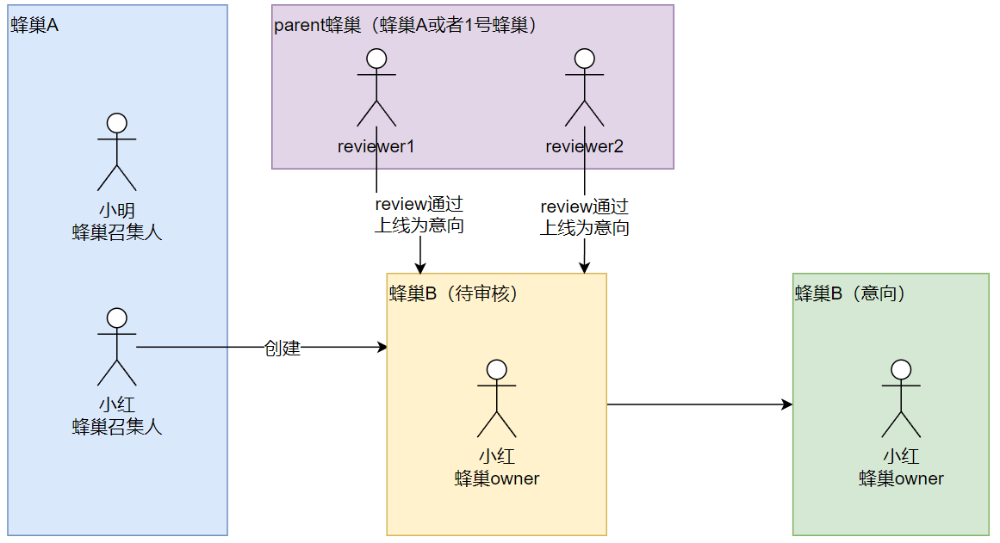

# 蜂巢概述（含流程）

## 什么是蜂巢

- 在2050，一个蜂巢，是一个紧密联系的小组，5~6人是一个中位数。
	- 共同目标，各自分工，能够互相补位，形成一种“支撑结构”
	- 每一个边，代表一个人
	- 以谢孟军为例，他既是网站组的核心成员，又是后端组的召集人
- 以上的图，虽然是一个二维平面，但事实上一个人可能同时出现在N个蜂巢，作为其中的召集人或核心成员
- 所谓裂变，就是某一个蜂巢的参与者，成为另一个新的蜂巢的召集人，并且开始做其他的一些工作。这些工作，也许原有的2050网站这个工作有关，也可能无关。
- 在2050网站之外，有很多种情况，形成了一个一个蜂巢，这些蜂巢的信息，在2050网站上沉淀下来。但是：形成的过程，不需要在2050网站上体现

简而言之，一个自愿者在2050从“被人带着玩儿”发展到“带别人一起玩儿”再到“别人带着别人一起玩儿”这个过程，是通过蜂巢这种组织结构展开的。

## 蜂巢的玩法

- 一个人能够发起一个蜂巢
- 一个人也能够参与一个蜂巢
- 一蜂巢中的参与者，可以创建（裂变）一个children蜂巢【意向】
- 不成熟的意向变成成熟的蜂巢
- 一个成熟的蜂巢可以发起一个以上的活动
- 每一个活动都属于某一个容器

### 流程：加入一个蜂巢

1. 自愿者小明是一个蜂巢A的召集人（owner或非owner）
1. 自愿者小明邀请自愿者小红成为这个蜂巢A的召集人
1. 自愿者小红成为了蜂巢A的召集人

### 流程：创建（裂变）一个children蜂巢【意向】

这里需要理解一组概念：parent蜂巢与children蜂巢。

当有人从蜂巢A裂变出一个蜂巢B时，则蜂巢A是蜂巢B的parent蜂巢；反过来说，蜂巢B是蜂巢A的children蜂巢。

**注意：**

不是所有蜂巢都可以作为parent蜂巢！parent蜂巢要承担“review其children蜂巢”的责任，所以一个蜂巢要成为parent蜂巢要满足一个最低条件：本蜂巢内至少有2个召集人是reviewer。如不满足条件或者无特别指定，则一个蜂巢默认的parent蜂巢为1号蜂巢，即“青年团聚百搭蜂巢”。

当一个children蜂巢刚刚被创建时，里面的召集人只有1个人，即发起人本人。这种情况下，reviewer一般不会直接将这个新的children蜂巢上线为正式的蜂巢，而是会将其上线为【意向】。【意向】的意思就是说这个蜂巢还不成熟，还不能用来发起活动；等有了更多的召集人加入，就代表这个【意向】成熟了，就可以成为一个**成熟的**蜂巢去发起活动了。

流程：

1. 自愿者小红从蜂巢A创建（裂变）新蜂巢
1. 一个新的蜂巢B进入到待审核后台。如果蜂巢A满足parent蜂巢条件，则蜂巢B的parent蜂巢是蜂巢A；如果蜂巢A不符合parent蜂巢条件，则其parent蜂巢是“青年团聚百搭蜂巢”
1. parent蜂巢里有2位reviewer审核通过该意向后，蜂巢B的【意向】上线了

### 流程：不成熟的意向变成成熟的蜂巢

一个不成熟的蜂巢【意向】什么时候能够变成一个“成熟的”蜂巢？这同样是通过reviewer的操作：只要parent蜂巢里有2个reviewer将其审核为成熟的蜂巢，它就被判定为成熟。具体操作见后续的“review蜂巢”章节。

### 流程：从蜂巢发起活动

我们平时接触的其他会议网站，一般会有一个按钮叫做“我也要发起活动（submit a proposal）”，用户点击了之后就可以直接填写一个表单，说明我要做的分享主题是什么，内容是什么，分享嘉宾是谁，等等。提交之后有一个组委会来审核这些proposal，通过的proposal就可以拿到会议上来进行分享。一般常见的情况是这样。

但是2050大会设计了一个不同的逻辑：

1. 活动必须从一个蜂巢发起（成熟的蜂巢）
2. 只有本蜂巢召集人能够从本蜂巢发起活动

这就意味着

3. 如果一个新用户要发起一场新的活动，ta要么成为一个已有蜂巢的召集人，要么成为一个新蜂巢的召集人

所以，虽然我们在2050网站上仍然会看到用户预期的“提交proposal”的按钮，但是这个按钮需要对于该用户的所属蜂巢状态进行一些前置判定。我们希望看到的趋势是：

1. 如果一个新用户是被一个老用户interface进来的，则老用户先把新用户纳入自己的蜂巢熟悉2050，了解玩法后可以创建新蜂巢
2. 如果一个新用户是离散的，没有interface关系，则十大容器召集人要帮忙新用户熟悉2050，同时撮合ta与其他新用户一起组建新蜂巢

整个前置判定流程如下：

## 一个蜂巢涉及的数据

- 基础信息
  - 蜂巢名称
  - 蜂巢介绍
  - 蜂巢logo
  - 蜂巢owner
- 关联信息
  - 蜂巢召集人
  - parent蜂巢、children蜂巢
  - 蜂巢相关的动态
  - 蜂巢发起的活动