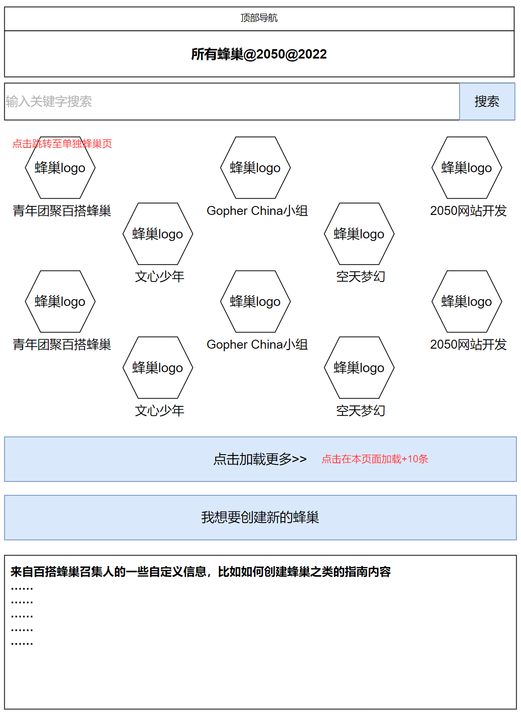
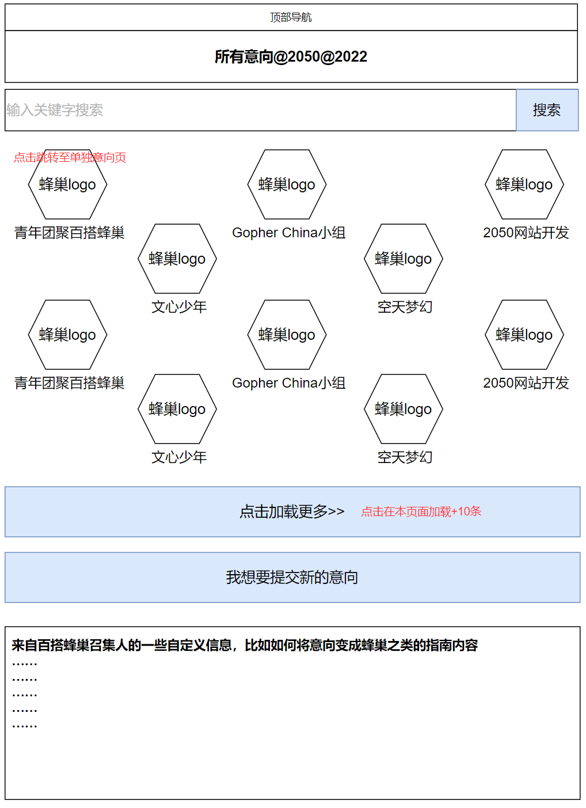

# 蜂巢首页、意向首页

## 页面说明

蜂巢（Hive）是在2050召集活动的基本单元。

意向（Proposal） = 一个预备中的蜂巢。一个意向经过review后可以变成一个蜂巢。

蜂巢和意向都可以上线被所有人看到。两者的区别在于，所有蜂巢都可以创建活动，部分蜂巢可以裂变新蜂巢，而意向则两种操作都不支持。

蜂巢首页（蜂巢列表页）显示所有已经上线的蜂巢。

意向首页（意向列表页）则显示所有已经上线的意向。

两个页面可以从顶部导航栏的“蜂巢”按钮进入。

## 蜂巢首页

## 意向首页

备注：“我想要创建新的蜂巢”和“我想要提交新的意向”按钮点击后的行为，见后续章节“裂变新的蜂巢”部分说明。此处按钮所创建的蜂巢，其parent蜂巢都是1号蜂巢，即“青年团聚百搭蜂巢”。