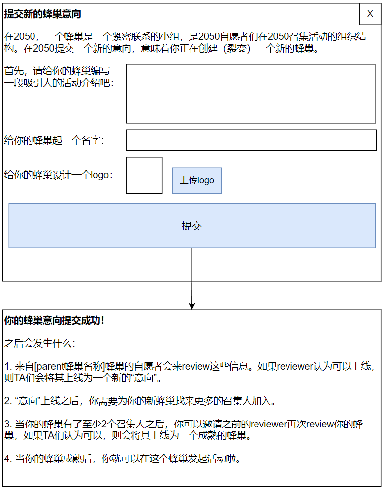

# 裂变（创建）新的蜂巢

## 功能说明

从蜂巢首页的“我想要创建新的蜂巢”、意向首页的“我想要提交新的意向”、单独蜂巢页当中的“裂变新的蜂巢”按钮，都会指向本功能。

从三个按钮过来，显示的界面内文字表述略有不同。

## 原型图

图中文字：

- 提交新的蜂巢意向
- 在2050，一个蜂巢是一个紧密联系的小组，是2050自愿者们在2050召集活动的组织结构。在2050提交一个新的意向，意味着你正在创建（裂变）一个新的蜂巢。
- 首先，请给你的蜂巢编写一段吸引人的活动介绍吧：
- 给你的蜂巢起一个名字：
- 给你的蜂巢设计一个logo：
- 你的蜂巢意向提交成功！
- 之后会发生什么：
1. 来自[parent蜂巢名称]蜂巢的自愿者会来review这些信息。如果reviewer认为可以上线，则TA们会将其上线为一个新的“意向”。
2. “意向”上线之后，你需要为你的新蜂巢找来更多的召集人加入。
3. 当你的蜂巢有了至少2个召集人之后，你可以邀请之前的reviewer再次review你的蜂巢，如果TA们认为可以，则会将其上线为一个成熟的蜂巢。
4. 当你的蜂巢成熟后，你就可以在这个蜂巢发起活动啦。

备注：

关于parent蜂巢的获取，请查阅[蜂巢概述](about-hive)里面的“创建（裂变）一个children蜂巢【意向】”部分内容。