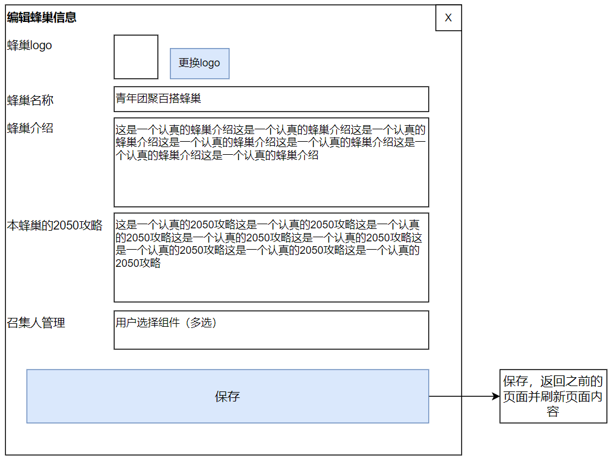
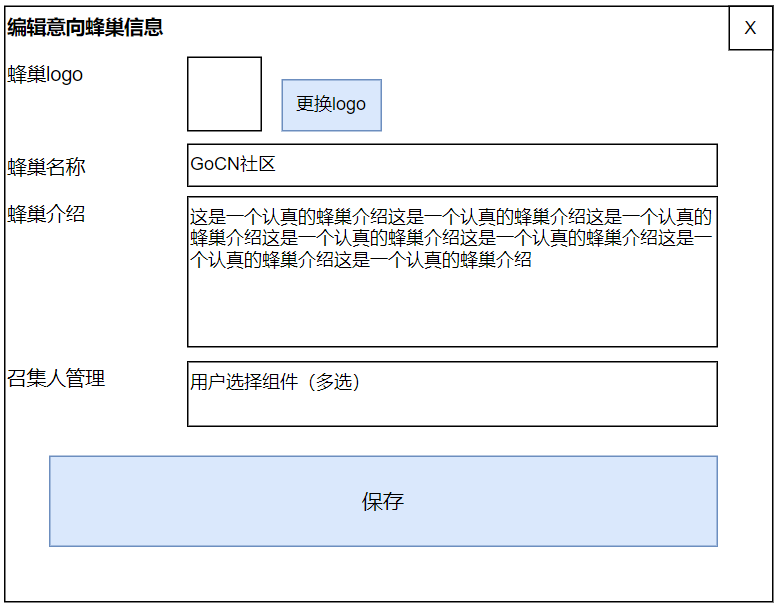

# 编辑蜂巢信息、编辑意向信息

## 功能说明

本功能从前台单独蜂巢页面/单独意向页面的“编辑蜂巢信息/编辑意向信息”按钮进入，或者从后台-蜂巢管理/意向管理页面当中的“编辑”按钮进入。

## 原型图：编辑蜂巢信息

图中文字：

- 编辑蜂巢信息
- 蜂巢logo
- 蜂巢名称
- 蜂巢介绍
- 本蜂巢的2050攻略
- 召集人管理

备注：用户选择组件（多选）的实现参考前面的用户篇。

## 原型图：编辑意向信息

图中文字：

- 编辑意向蜂巢信息
- 蜂巢logo
- 蜂巢名称
- 蜂巢介绍
- 召集人管理

备注：用户选择组件（多选）的实现参考前面的用户篇。
