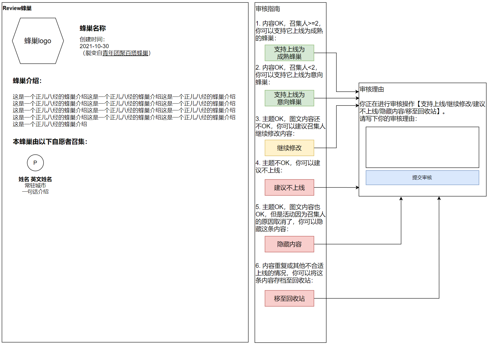

# 审核蜂巢

## 功能说明

本功能从后台-蜂巢管理/意向管理页面当中的“审核”按钮进入。

## 原型图

图中文字：

- 蜂巢名称
- 蜂巢介绍
- 本蜂巢由以下自愿者召集：
- 审核指南
1. 内容OK，召集人>=2，你可以支持它上线为成熟的蜂巢：
2. 内容OK，召集人<2，你可以支持它上线为意向蜂巢：
3. 主题OK，图文内容还不OK，你可以建议召集人继续修改内容：
4. 主题不OK，你可以建议不上线：
5. 主题OK，图文内容也OK，但是活动因为召集人的原因取消了，你可以隐藏这条内容：
6. 内容重复或其他不合适上线的情况，你可以将这条内容存档至回收站：
- 审核理由
- 你正在进行审核操作【支持上线为成熟的蜂巢/支持上线为意向蜂巢/继续修改/建议不上线/隐藏内容/移至回收站】。
- 请写下你的审核理由：