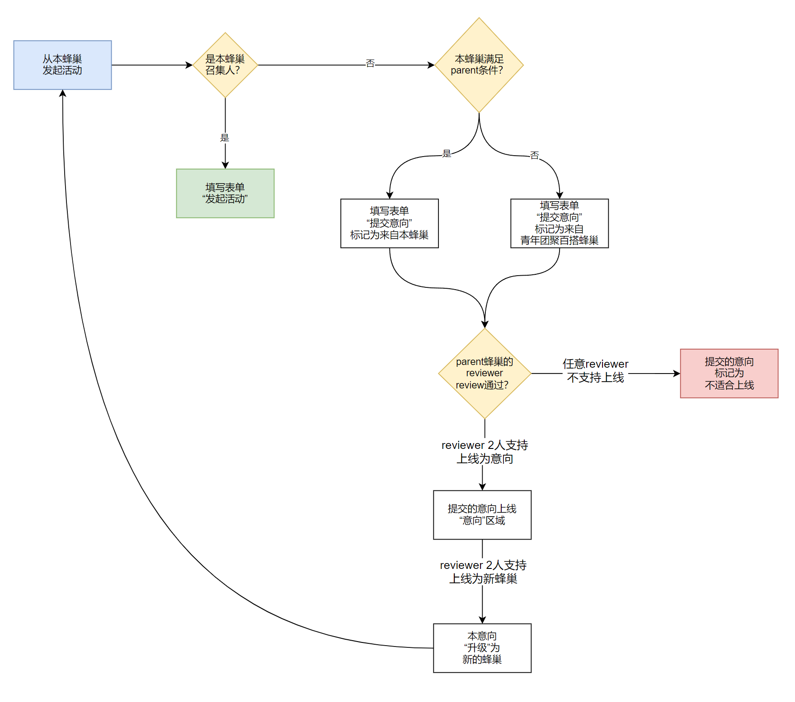

# 从蜂巢发起活动的流程图

在2050的任意容器发起一个活动的规则概述：

1. 活动必须从一个蜂巢发起
2. 只有本蜂巢召集人能够从本蜂巢发起活动

这就意味着

3. 如果一个新用户要发起一场新的活动，ta要么成为一个已有蜂巢的召集人，要么成为一个新蜂巢的召集人

我们希望看到的趋势：

1. 如果一个新用户是被一个老用户interface进来的，则老用户先把新用户纳入自己的蜂巢熟悉2050，了解玩法后可以创建新蜂巢
2. 如果一个新用户是离散的，没有interface关系，则十大容器召集人要帮忙新用户熟悉2050，同时撮合ta与其他新用户一起组建新蜂巢

