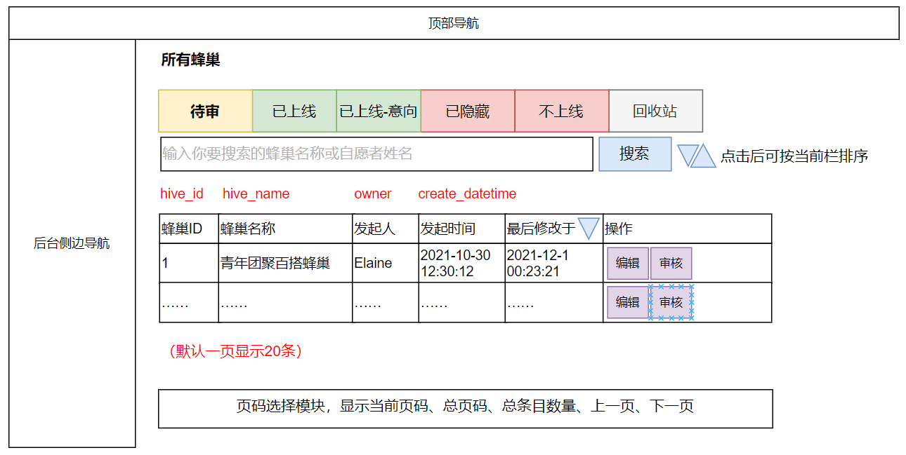
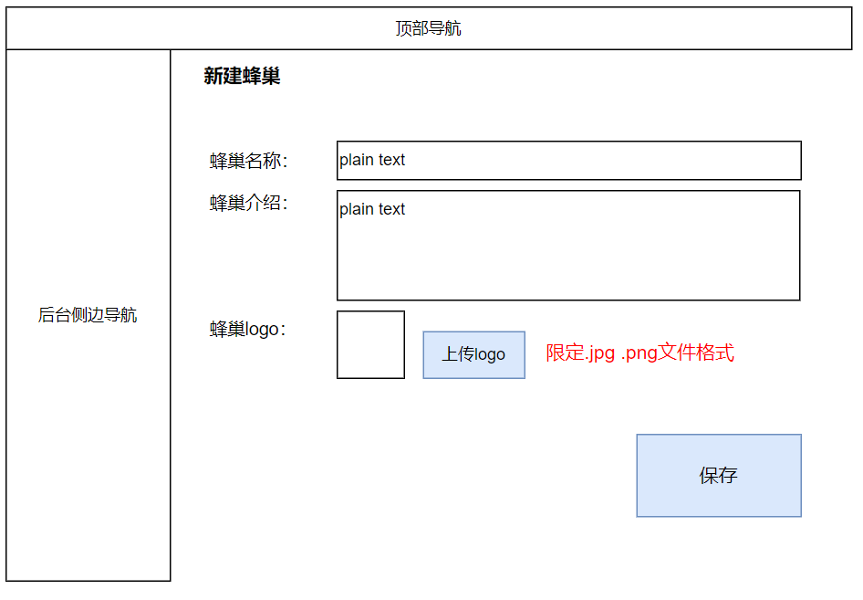
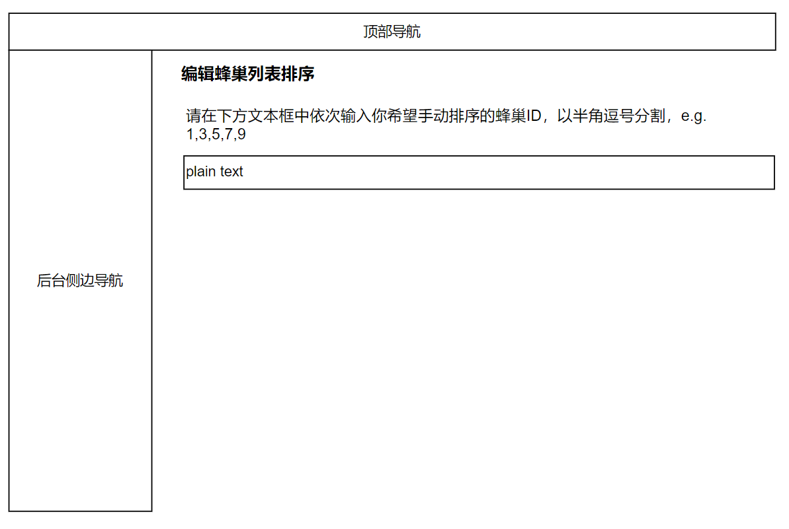
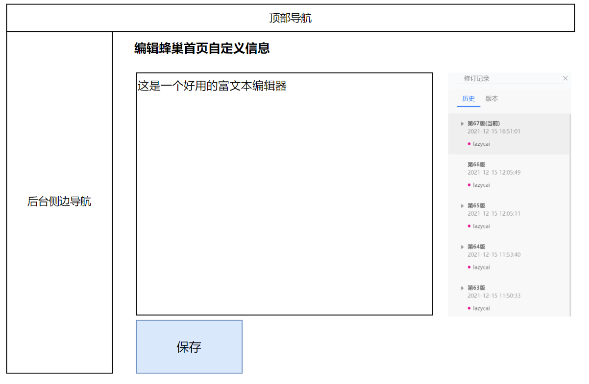
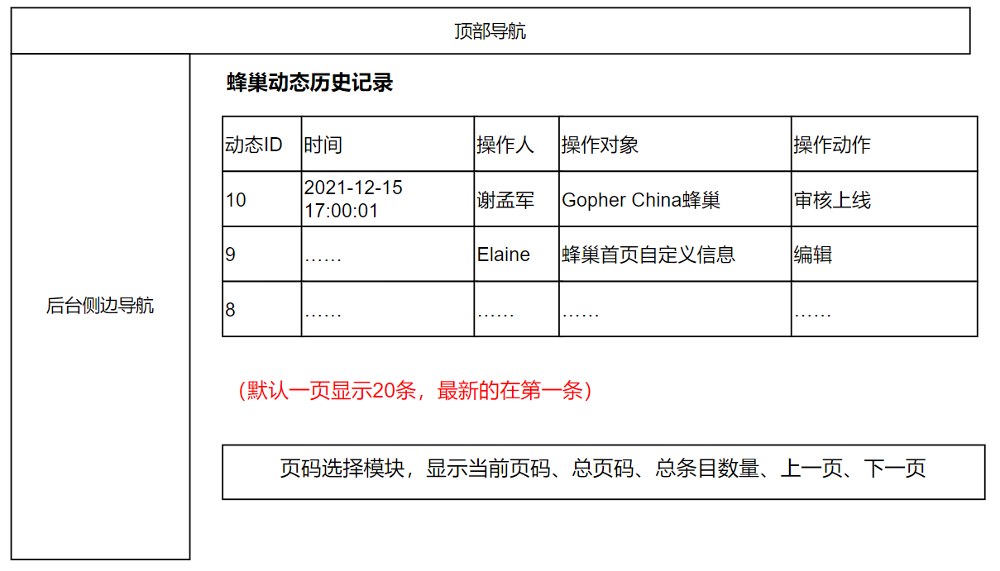

# 后台-蜂巢管理、意向管理

## 功能说明

蜂巢管理后台包含页面：

1. 所有蜂巢
2. 新建蜂巢
3. 编辑蜂巢列表排序
4. 编辑蜂巢首页自定义信息
5. （可选）蜂巢动态历史记录

## 所有蜂巢

备注：每一个蜂巢的名称含超链接指向该蜂巢页面。

## 创建蜂巢

备注：第一个蜂巢必须由管理员使用这个后台功能创建，后续的蜂巢理论上都可以由每个用户从前台操作创建。

## 编辑蜂巢列表排序

## 编辑意向列表排序

界面布局同上。

## 编辑蜂巢首页自定义信息

## 编辑意向首页自定义信息

界面布局同上。

## 蜂巢动态历史记录

