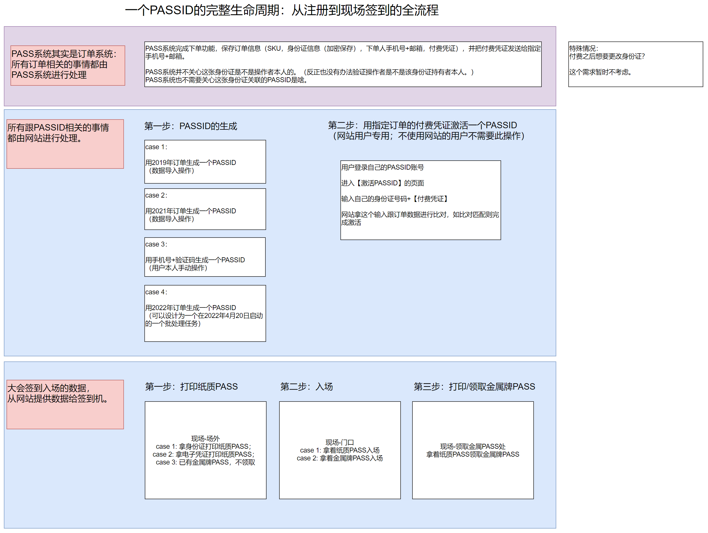

# PASSID概述（含流程）

## 什么是PASSID

PASSID就是代表了一个人（2050自愿者）在2050（2050大会 & 2050网站）的一个身份标识，代表了一个人和2050产生关系的那个代表ID。

实际上PASSID就是代表了一个人在2050的一个身份标识，在网站体系下就是用户ID。

## PASSID的生命周期

PASSID的生成、导入与激活，在后续章节“PASSID的生成与导入”“我的PASS章节”有详细解说。

## 关于PASSID的常见问题

### **Q**：必须付费了才会有**PASSID**吗？

A：不必要。付费的作用是“激活”一张PASS，使其可以作为下一年2050大会的入园凭证使用。

### **Q**：一个人可以帮他人生成**PASSID**吗？

A：可以。

当一个人在订单系统下单，可以输入他人的身份证号/护照号码生成订单。该订单如果一直无人在网站上进行激活PASSID的操作，则会在指定时间生成新的PASSID，并将其初始登录密码发送给下单人的手机+邮箱。

### **Q**：一个人可以使用**PASSID**登录**2050**网站吗？

可以。支持PASSID+密码形式登录。

### **Q**：一个人从不使用**2050**网站，也可以拥有**PASSID**吗？

A：可以。别人帮TA代购PASS，本人就可以不登陆网站就拥有一个PASSID。

### **Q**：别人帮我代购过**PASS**，当时有过一个**PASSID**，打印过金属牌；我后来自己又注册了**2050**网站，又有了一个**PASSID**。我可以把两个**PASSID**合并吗？

A：不可以。

不过，当你第一次使用手机号登录2050网站时，网站会敲锣打鼓地提醒你绑定之前的PASSID。