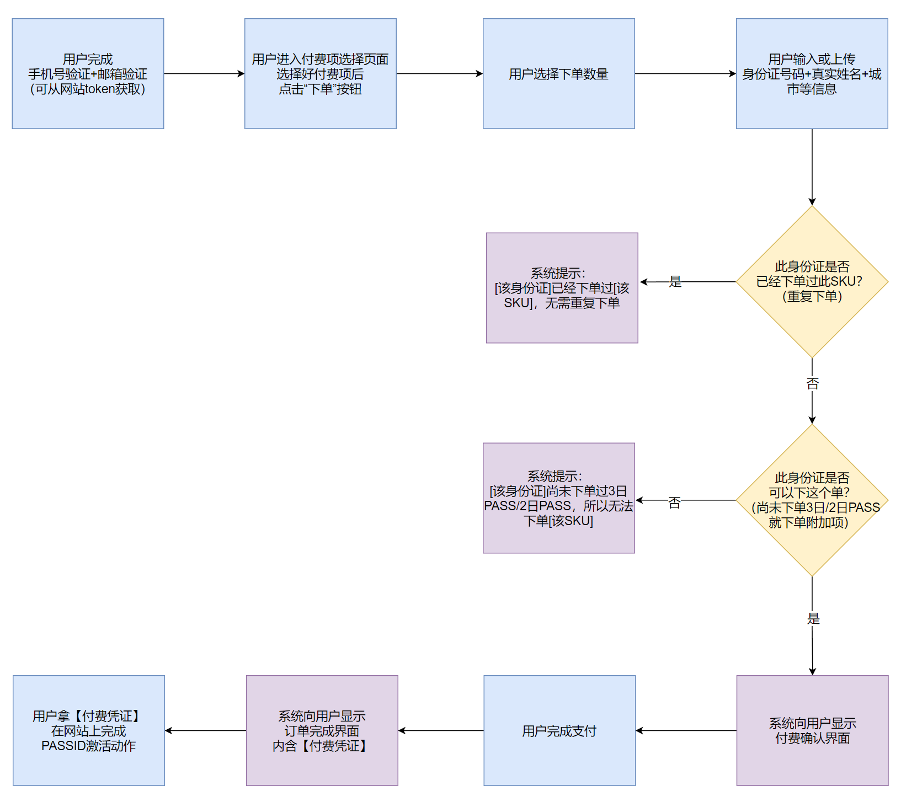

# PASSID的激活

## 作为大会进场凭证的PASSID

每年4月底，三天的2050大会，每一个进场的人都拥有一个PASSID作为身份标识。这一个PASSID是：

1. 被付费激活过的（3日330元或2日660元）
1. 能够对应到持有者的身份证或护照号码
1. 跟持有者姓名一起被激光打印在一个金属牌子上
1. 同时也可以激活逐日晨跑、星空露营等付费的附加项
1. 同时也可以用来登录2050网站

付费激活并无线下入口，只有一个唯一的线上入口[getmypass.2050.org.cn](https://getmypass.2050.org.cn)。

一个用户必须要**完成手机号+邮箱的验证**，然后才能进行付费下单的操作。

## 下单付费到激活PASSID全流程图

