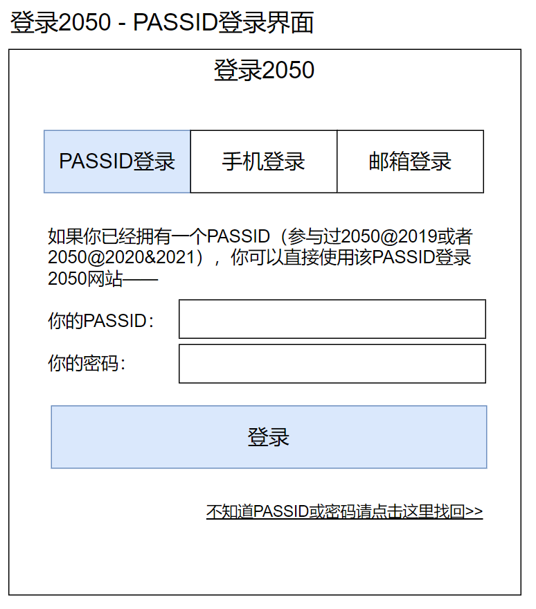

# 用户注册与登录

## 用户实名信息收集最低要求

我国《[个人信息保护法](http://www.npc.gov.cn/npc/c30834/202108/a8c4e3672c74491a80b53a172bb753fe.shtml)》规定不得过度收集个人信息，并且个人信息的收集与使用需要经过用户授权。2050网站需要遵循此法律法规。

以下列出每一种用户行为最低需要收集的个人信息：

- 注册成为网站用户：一个经过验证的电子邮箱
- 在网站发起蜂巢和发起活动：一个经过验证的手机号码
- 激活PASS现场参会：身份证实名验证

## 2050网站对于用户注册与登录的功能需求

1. 支持提供token给PASS系统（订单系统）作为单点登录的凭证
1. 支持PASSID+密码登录
1. 支持国内手机号码+验证码注册登录
1. 支持国际手机号码+验证码注册登录
1. 支持邮箱+验证码注册登录
1. 支持手机号码+密码登录
1. 支持邮箱+密码登录

### 登录入口

网站右上角“我的2050”按钮，如果是未登录状态，则点击之后进入登录页面。

### 使用PASSID+密码登录

#### 使用PASSID找回密码

### 使用手机号+验证码注册/登录

### 使用手机号+密码登录

### 使用邮箱+验证码注册/登录

### 使用邮箱+密码登录

