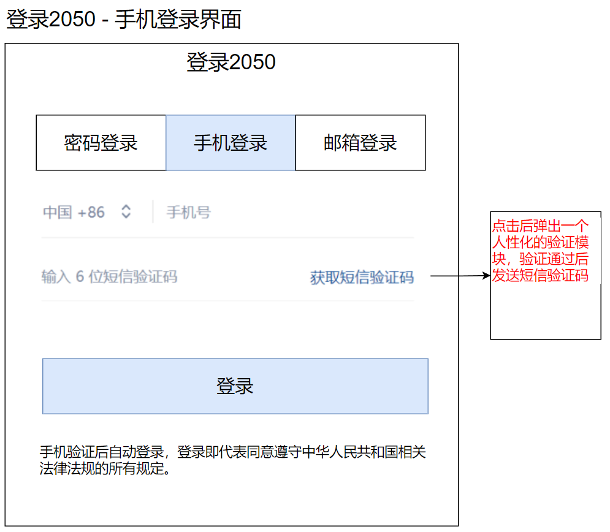
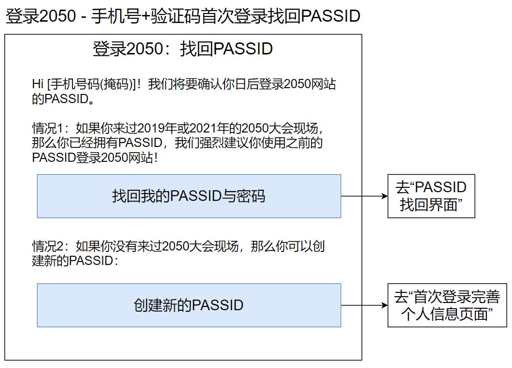
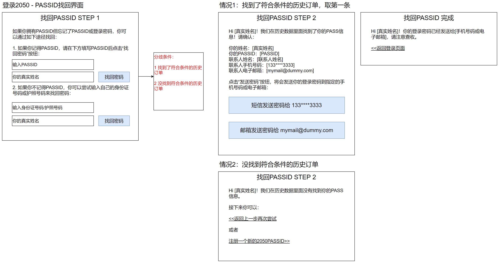
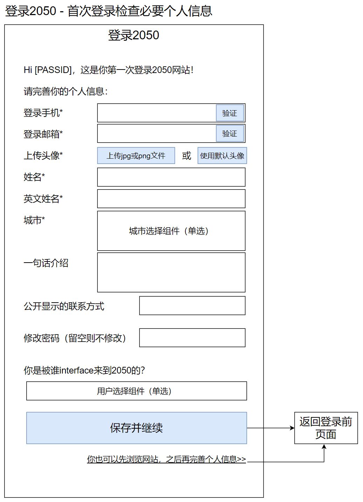
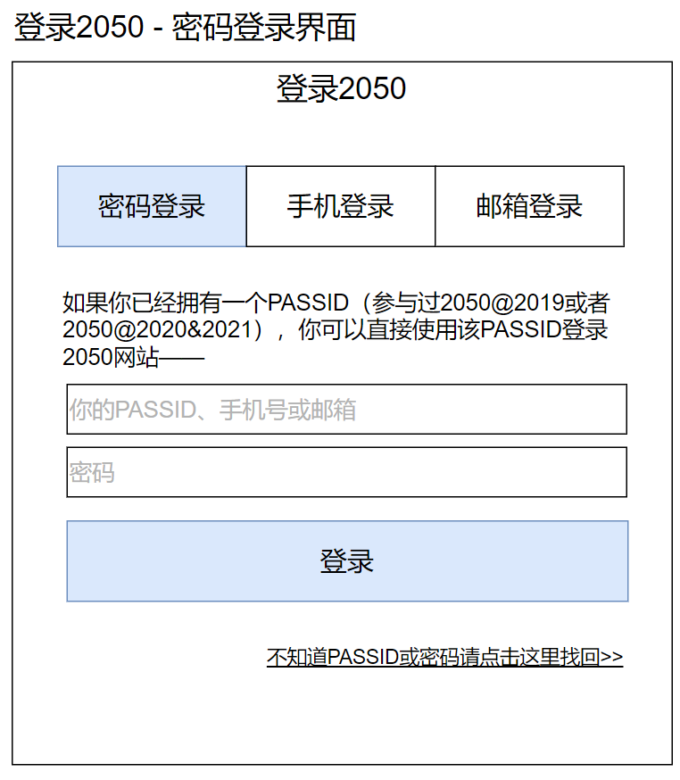
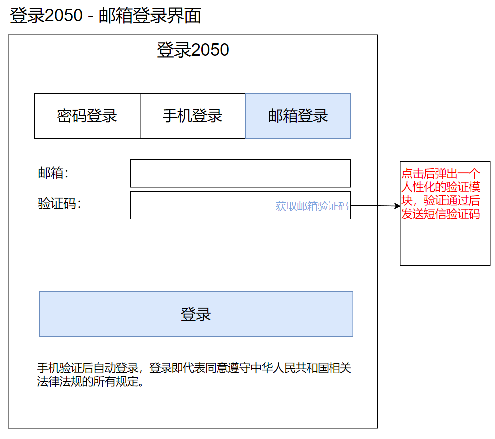

# 用户注册与登录

## 组件说明

用户注册与登录是网站的基本功能。2050网站对于用户注册与登录的功能需求如下：

1. 支持国内手机号码+验证码注册登录
1. 支持国际手机号码+验证码注册登录
1. 支持PASSID+密码登录
1. 支持手机号码+密码登录
1. 支持邮箱+密码登录
1. 支持邮箱+验证码登录
1. 支持提供token给PASS系统（订单系统）作为单点登录的凭证

## 登录入口

见后续“[作为登录入口的顶部导航栏](navbar)”章节。

## 注册

2050网站使用手机号+验证码的方式注册。

图中文字：

- 登录2050
- 密码登录
- 手机登录
- 邮箱登录
- 手机号
- 输入6位短信验证码
- 获取短信验证码
- 登录
- 手机验证后自动登录，登录即代表同意遵守中华人民共和国相关法律法规的所有规定。

用户点击“登录”后，识别该用户是否第一次登录。

- case 1 该用户不是第一次登录，让其登录对应的PASSID进入网站。
- case 2 该用户是第一次登录，启动注册流程：

图中文字：

- Hi [手机号码(掩码)]！我们将要确认你日后登录2050网站的PASSID。
- 情况1：如果你来过2019年或2021年的2050大会现场，那么你已经拥有PASSID，**我们强烈建议你使用之前的PASSID登录- 2050网站！**
- 找回我的PASSID与密码
- 情况2：如果你没有来过2050大会现场，那么你可以创建新的PASSID：
- 创建新的PASSID

### PASSID找回密码页面

图中文字：

- 如果你拥有PASSID但忘记了PASSID或登录密码，你可以通过如下途径找回：
- 1. 如果你记得PASSID，请在下方填写PASSID后点击“找回密码”按钮：
- 输入PASSID
- 你的真实姓名
- 找回密码
- 2. 如果你不记得PASSID，你可以尝试输入自己的身份证号码或护照号码来找回密码：
- 输入身份证号码/护照号码
- 你的真实姓名
- 找回密码
- Hi [真实姓名]！我们在历史数据里面找到了你的PASS信息！请确认：
- 你的姓名：[真实姓名]
- 你的PASSID：[PASSID]
- 联系人姓名：[联系人姓名]
- 联系人手机号码：[133****3333]
- 联系人电子邮箱：[mymail@dummy.com]
- 点击“发送密码”按钮，将会发送你的登录密码到指定的手机号码或电子邮箱：
- 短信发送密码给 133****3333
- 邮箱发送密码给 mymail@dummy.com
- Hi [真实姓名]！我们在历史数据里面没有找到你的PASS信息。
- 接下来你可以：
- <<返回上一步再次尝试
- 或者
- 注册一个新的2050PASSID>>
- Hi [真实姓名]！你的登录密码已经发送给[手机号码或电子邮箱]，请注意查收。
- <<返回登录页面

### 首次登录完善个人信息页面

用户首次登录，或者用户登录后发现个人信息尚未完善的，弹出提示信息

注意：如果用户信息未完善，则每次登录后都会显示此提示。后续当用户要发起蜂巢和活动时，如果用户信息未完善，也会显示此提示。**必须要完善这里的个人信息才能够继续进行蜂巢和活动的创建。**

图中文字：

- Hi [PASSID]，这是你第一次登录2050网站！
- 请完善你的个人信息：
- 登录手机*
- 登录邮箱*
- 上传头像*  上传jpg或png文件 或 使用默认头像
- 姓名*
- 英文姓名*
- 城市*
- 一句话介绍
- 公开显示的联系方式
- 修改密码（留空则不修改）
- 你是被谁interface来到2050的？
- 保存并继续

## 登录

### 使用PASSID/手机号/邮箱+密码登录

图中文字：

- 如果你已经拥有一个PASSID（参与过2050@2019或者2050@2020&2021），你可以直接使用该PASSID登录2050网站——
- 你的PASSID、手机号或邮箱
- 密码
- 登录
- 不知道PASSID或密码请点击这里找回>>

登录失败（用户不存在或者密码错误）则在输入框上方显示错误信息：

- 用户名或密码错误。

### 使用手机号+验证码登录

同“使用手机号+验证码注册”。

### 使用邮箱+验证码登录

登录失败（用户不存在或者验证码错误）则在输入框上方显示错误信息：

- 邮箱或验证码错误。

## 用户实名信息收集最低要求

我国《[个人信息保护法](http://www.npc.gov.cn/npc/c30834/202108/a8c4e3672c74491a80b53a172bb753fe.shtml)》规定不得过度收集个人信息，并且个人信息的收集与使用需要经过用户授权。2050网站需要遵循此法律法规。

以下列出每一种用户行为最低需要收集的个人信息：

- 注册成为网站用户：一个经过验证的手机号码
- 激活PASS：身份证号码+真实姓名

