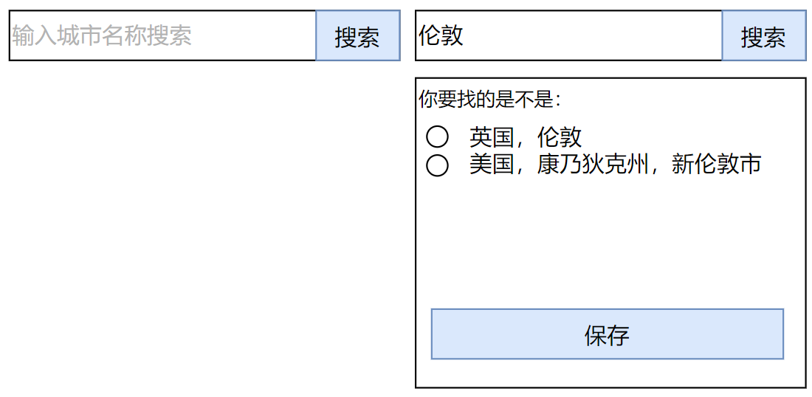

# 城市数据库与城市选择组件

## 组件说明

2050网站的一大特色在于每个自愿者都把自己的城市公布出来，所有2050自愿者来自世界各地的城市信息汇聚在一起形成一张世界时区地图。

由于全世界的城市名称太多了，如果每个自愿者自由填写城市名称的话，后续会需要做大量的校对，并且由于有些地区的城市名称可能涉及到合法合规性，这个校对如果人肉来做的话就非常的浪费。所以，我们需要有一个**全世界所有城市名称的数据库**，并通过一个**城市选择组件**把它开放给用户使用。

## 城市选择组件-单选

