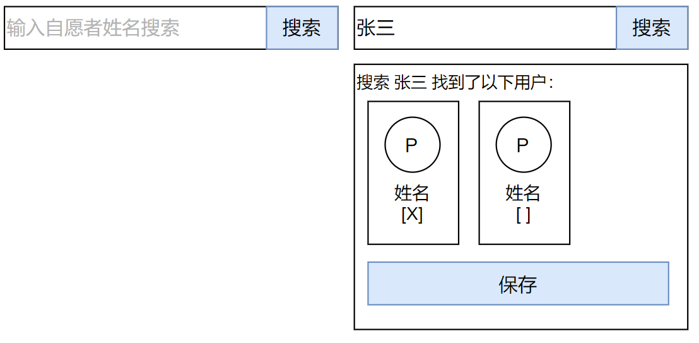
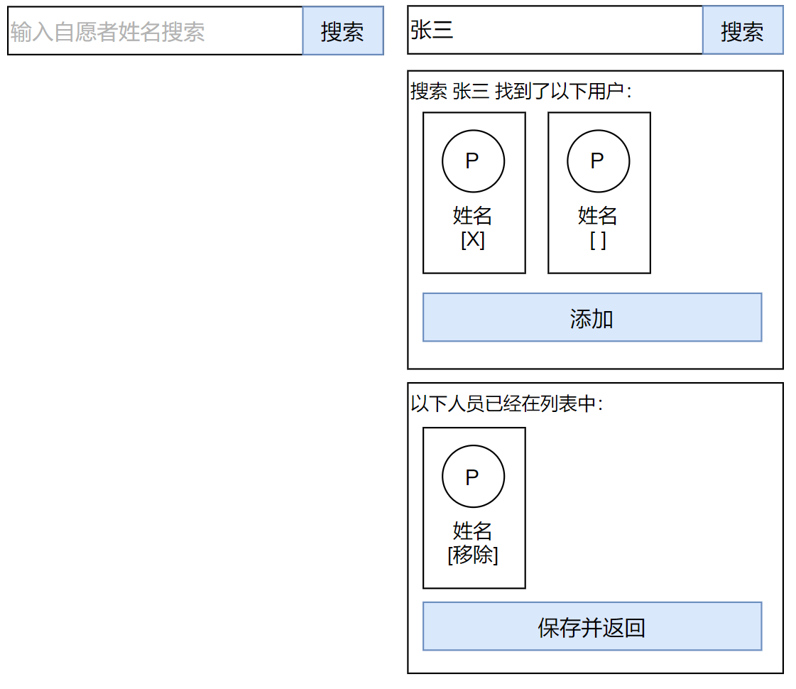

# 用户选择组件

## 组件说明

2050网站有很多功能需要用户选择另一个2050用户，比如在编辑个人信息时，需要选择“自己是被谁interface到2050的”；在创建蜂巢和活动时，需要选择蜂巢和活动的召集人。因此，需要一个通用的用户选择组件，让用户可以输入一个自愿者的姓名，然后在用户数据库中检索到对方的用户信息，继而进行单选或多选。

## 用户选择组件-单选

单选组件常用于interface关系信息的输入。

## 用户选择组件-多选

多选组件常用于蜂巢以及活动的召集人信息的输入。