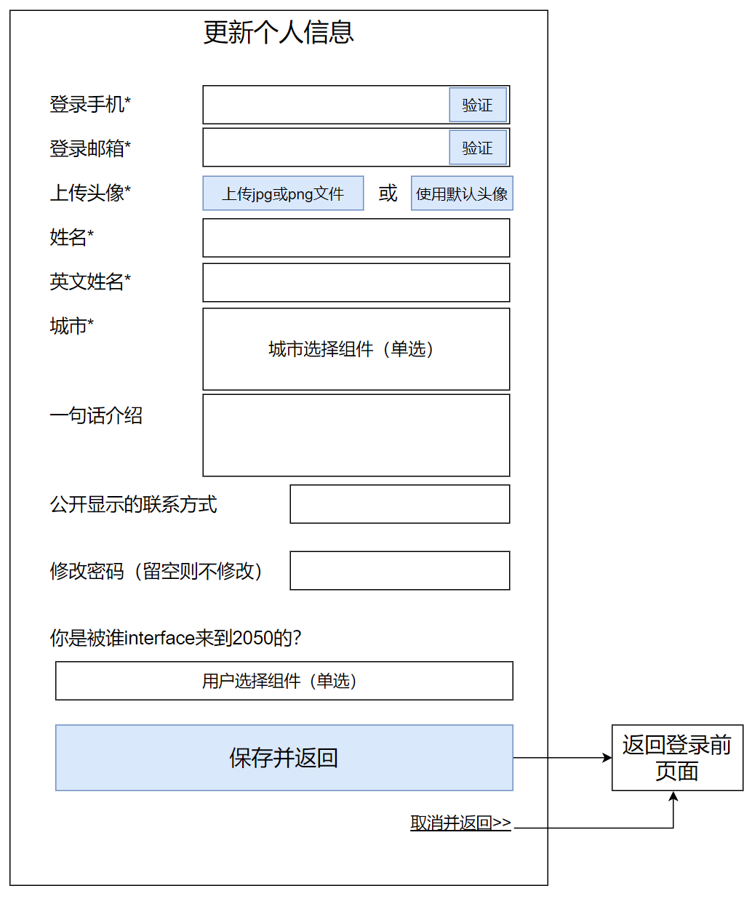
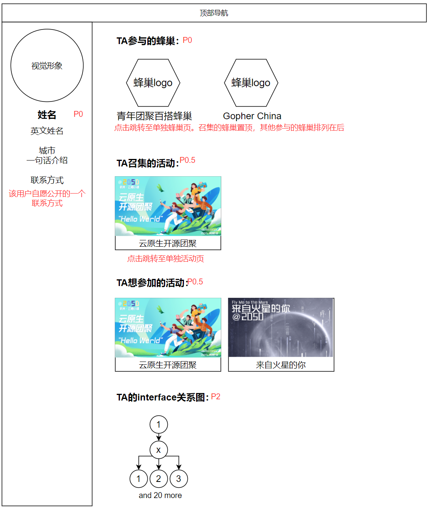

# 我的自愿者档案与别人的自愿者档案

## 页面说明

登录用户从右上角“我的2050”菜单可进入“我的自愿者档案”页面。

用户可以在这个页面看到自己的个人信息，召集和参与了哪些2050活动，以及自己的interface关系（这个interface关系图优先级P3，前期先不用做）。

## 页面原型图

## 点击“更新个人信息”按钮后显示界面

## 当别人查看我的页面或我查看别人的页面时

在蜂巢页面和活动页面里，召集人的头像可以被点击，点击后显示其自愿者档案。这个自愿者档案页面布局与“我的自愿者档案”完全一样，只是没有“更新个人信息”的按钮，如图：

