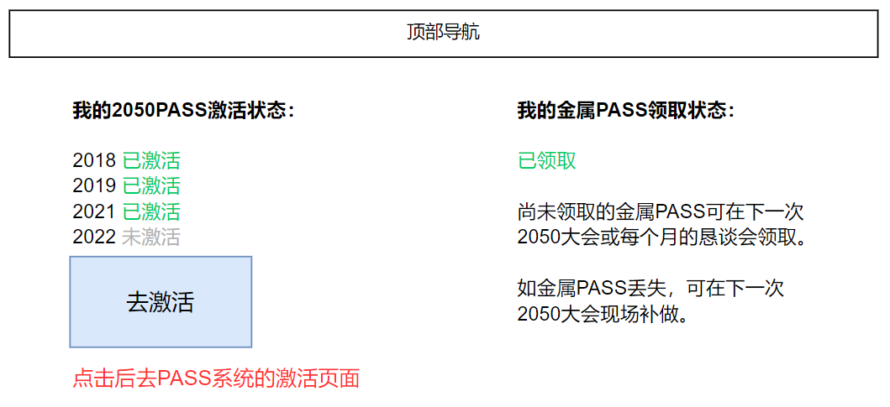
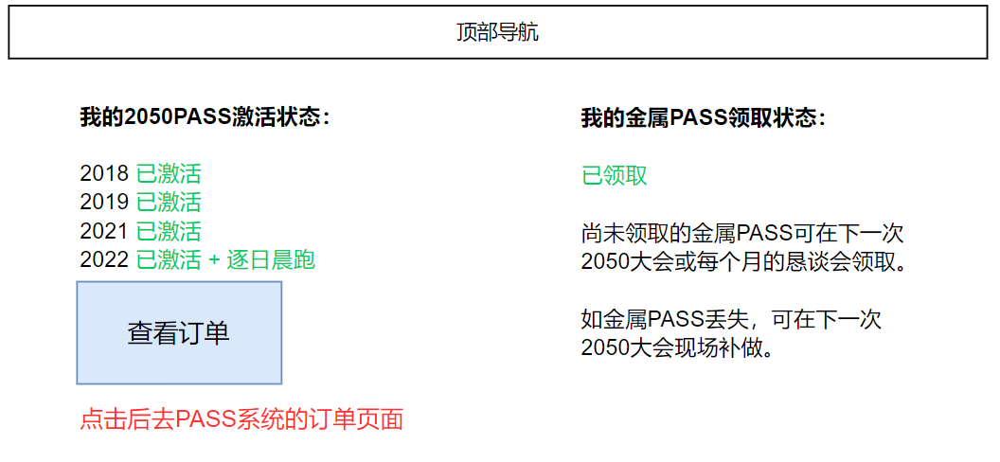

# 我的PASS

## 页面说明

登录用户从右上角“我的2050”菜单可进入“我的PASS”页面。

本页面显示当前登录用户的PASS激活状态以及金属牌领取状态。

## 页面原型-今年尚未激活PASS的情况

图中文字：
- 我的2050PASS激活状态：
- 我的金属PASS领取状态：
- 尚未领取的金属PASS可在下一次2050大会或每个月的恳谈会领取。
- 如金属PASS丢失，可在下一次2050大会现场补做。
- 请输入**你自己的**身份证号码：
- 请输入付费凭证：
- 注意：这里必须填写自己的身份证号码！不要填写别人的！

## 页面原型-今年已激活PASS的情况

