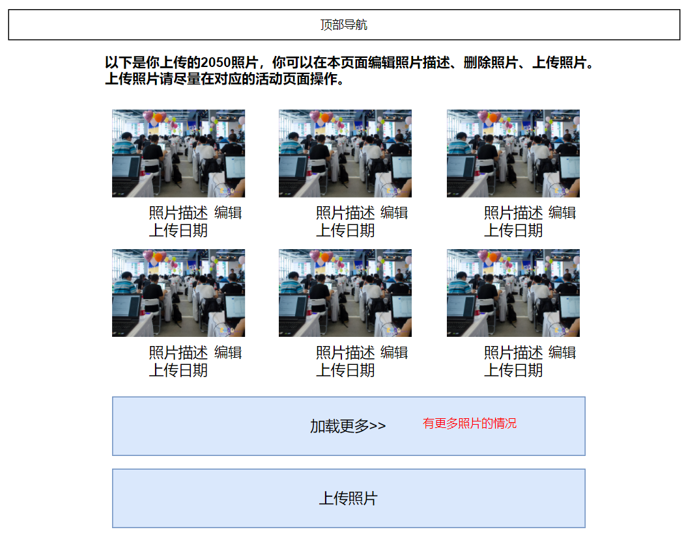
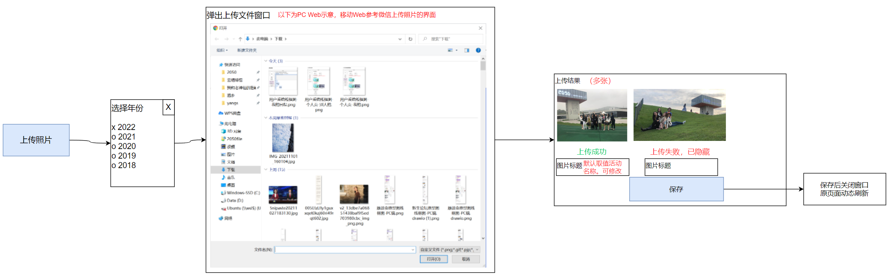
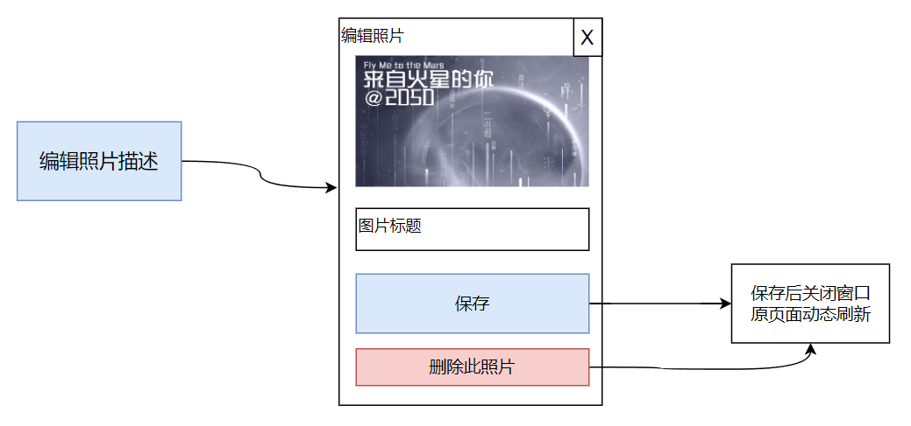

# 我上传的照片、我上传的视频

## 页面说明

登录用户从右上角“我的2050”菜单可进入“我上传的照片”、“我上传的视频”页面。

本页面显示当前登录用户已上传的照片/视频。

## 页面原型-我上传的照片

### 点击“上传照片”按钮后显示界面

### 点击“编辑照片信息”按钮后显示界面

## 页面原型-我上传的视频

整个页面布局同“我上传的照片”，故略。页面中文字“照片”需要替换成“视频”。