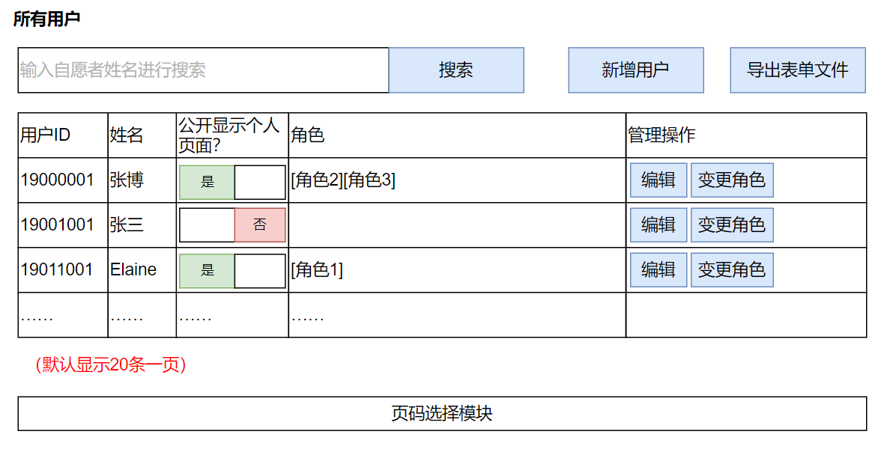
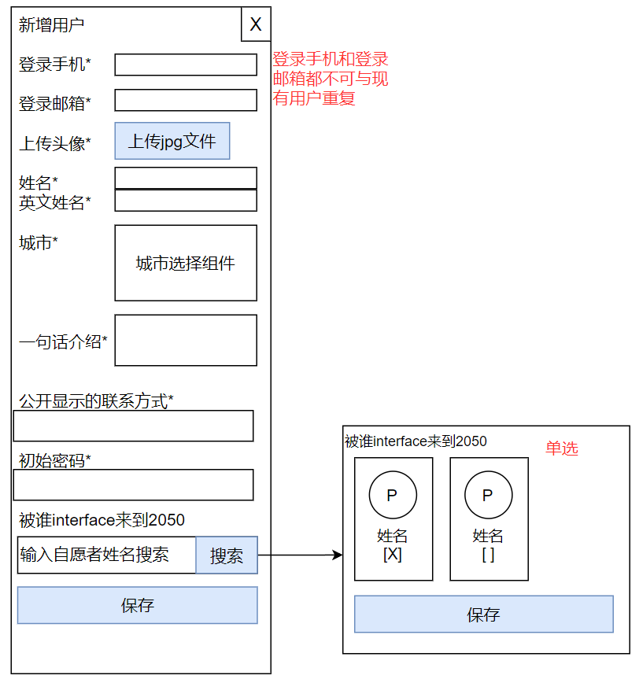
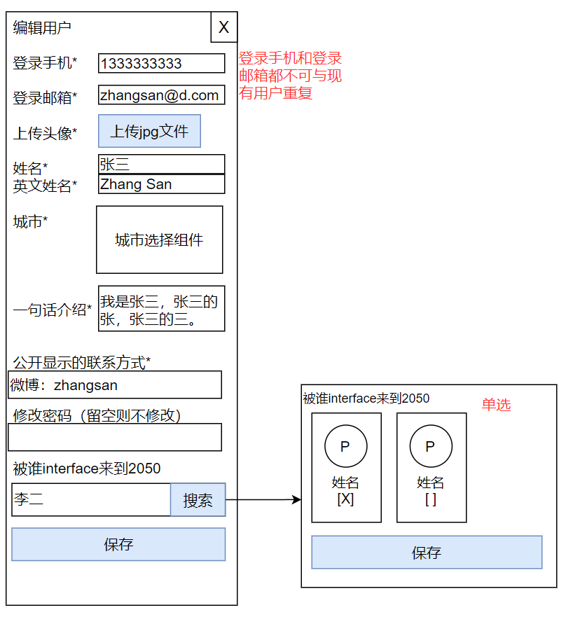

# 后台-用户管理界面

## 页面说明

管理员可以进入本页面管理所有的网站用户。

## 管理所有用户

### 管理员点击新增用户

### 管理员点击编辑用户

### 管理员变更用户角色

2050网站的用户角色罗列如下——

- 超级管理员
- 用户管理员
- 蜂巢管理员；蜂巢reviewer；某蜂巢owner；某蜂巢召集人
- 青年团聚容器召集人；青年团聚reviewer
- 新生论坛容器召集人；新生论坛reviewer
- 探索空间容器召集人；探索空间reviewer
- 热带雨林容器召集人；热带雨林reviewer
- 思想约会容器召集人；思想约会reviewer；某约会的约会人
- 热力运动容器召集人；热力运动reviewer
- 逐日晨跑召集人；
- 足球风暴召集人；
- 星空露营容器召集人；星空露营reviewer
- 青春舞台容器召集人；青春舞台reviewer
- 候鸟计划容器召集人
- 2050青年容器召集人
- 百城味道召集人；百城味道reviewer
- 大会现场总指挥（场地总协调）；场地信息管理员；物资信息管理员
- 照片管理员；照片reviewer；海报大道召集人
- 视频管理员；视频reviewer
- 投稿管理员；投稿reviewer
- 翻译
- 普通用户
- 黑名单用户

todo：各角色对应权限的细化信息。

在P0到P1阶段，暂时只需要区分超级管理员与普通用户这两种角色即可。