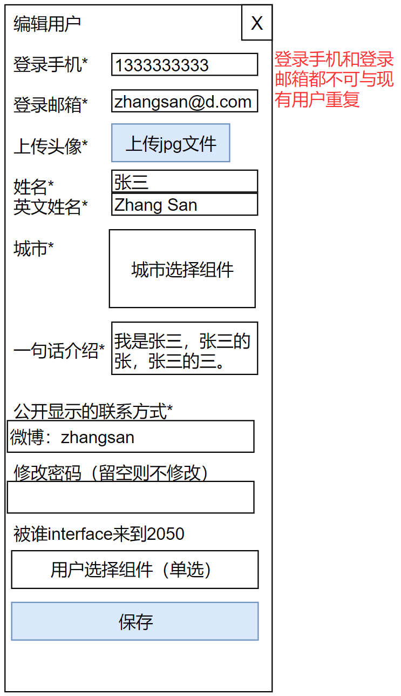

# 后台-用户管理界面

## 页面说明

管理员可以进入本页面管理所有的网站用户。

## 管理所有用户

## 管理员点击新增用户

备注：管理员新增用户时不要求验证手机号码和邮箱的真实性。

## 管理员点击编辑用户

## 管理员变更用户角色

图中文字：

- 变更角色
- 全站角色
- 蜂巢角色
- 容器角色
- 其他角色
- 超级管理员
- 普通用户（默认）
- 管理员
- reviewer
- 翻译
- 青年团聚
- 新生论坛
- 探索空间
- 热带雨林
- 思想约会
- 热力运动
- 星空露营
- 青春舞台
- 候鸟计划
- 2050青年
- 百城味道
- 恳谈会
- 场地信息
- 照片
- 视频
- 投稿
- 添加权限
- 提示：如将该用户权限全部移除，则该用户将无法加入蜂巢/创建蜂巢/发起活动。
- 保存

关于reviewer与管理员/容器召集人的权限区别：

reviewer可以查看对应类型的待审核列表并进入相应内容的review页面。管理员/容器召集人则在此权限之上，再添加了变更对应首页的自定义信息和内容排序管理的权限。

在P0到P1阶段，暂时只需要区分超级管理员与普通用户这两种角色即可。